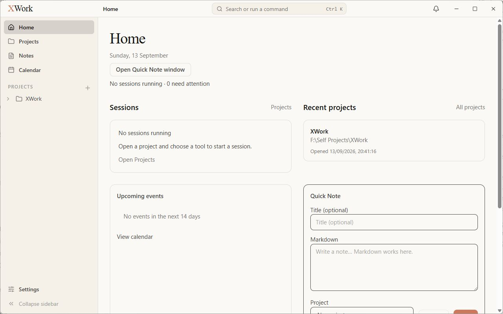
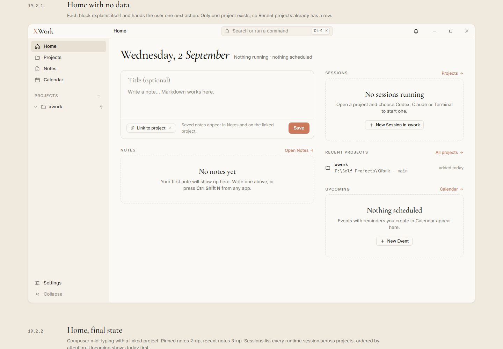
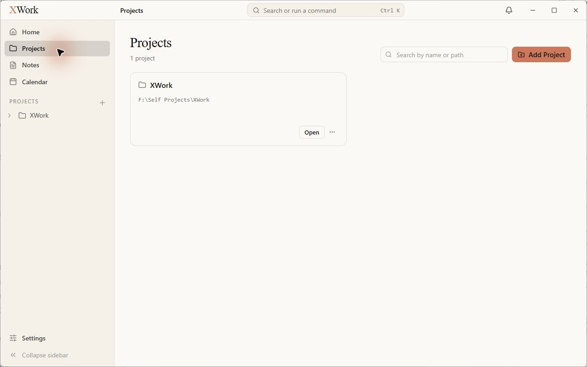
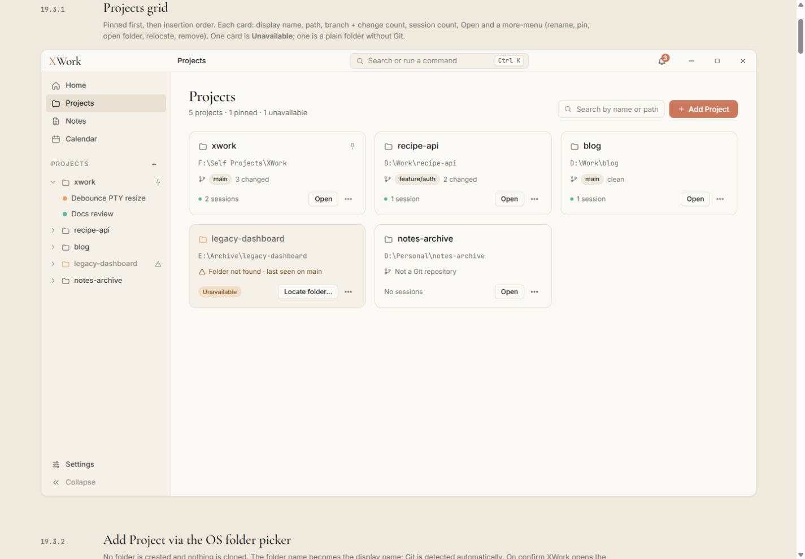
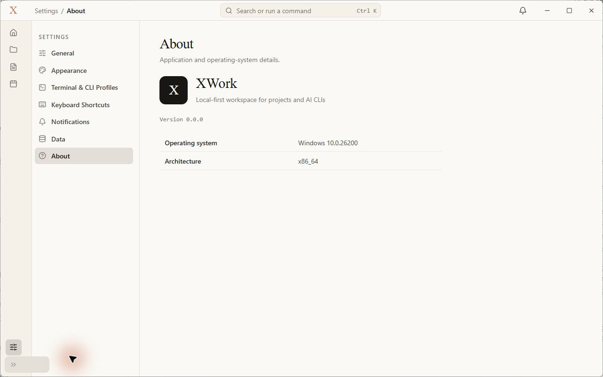

# Khung ứng dụng và phong cách chung — đối chiếu UI

Ngày kiểm tra: 13/09/2026. Trạng thái: chỉ ghi nhận, chưa sửa. Điều kiện chung và cách hiểu mức độ: [Tổng quan](00-Overview.md).

## Wireframe đối chiếu

- [19.1.2 — Khung đầy đủ](../../01-Wireframe/02-AppShell.html#shell)
- [19.1.3 — Sidebar thu gọn](../../01-Wireframe/02-AppShell.html#shell-collapsed)
- [Quy ước màu, chữ và thành phần](../../01-Wireframe/01-Index.html)

## Các bước đã quan sát

1. Mở bản Windows, quan sát Home và các trang con.
2. Thu gọn sidebar tại Settings/About, chụp ảnh, rồi mở rộng trở lại.

## Điểm chưa khớp

### UI-SHELL-01 · P2 — Bộ chữ thực tế khác bộ chữ đang được render trong wireframe

- **Hiện tại:** Tiêu đề của app có nét Times/Garamond hệ thống; nội dung và mã dùng bộ chữ hệ thống, khác hình dáng Cormorant Garamond, Inter và JetBrains Mono trong bản mẫu.
- **Wireframe:** Wireframe dùng bộ font thay thế được tải trong wireframe.css; tiêu đề mảnh, rộng và có nhịp chữ khác rõ ở Home, Projects, About.
- **Ảnh hưởng:** Làm thay đổi cảm giác tổng thể, độ dài dòng và phân cấp chữ ngay cả khi bỏ qua chênh lệch cỡ chữ.
- **Bằng chứng:** [01-app-home-top](assets/2026-09-13/01-app-home-top.jpg) · [01-ref-home-empty](assets/2026-09-13/01-ref-home-empty.jpg).

### UI-SHELL-02 · P2 — Nền mục đang chọn chuyển sang xám thay vì kem đậm

- **Hiện tại:** Home/Projects/Settings đang chọn và session được chọn có nền xám lạnh hơn hẳn nền sidebar.
- **Wireframe:** Mục đang chọn dùng surface-cream-strong #e8e0d2, giữ sắc kem ấm.
- **Ảnh hưởng:** Điểm nhấn chọn không đồng nhất với bảng màu của wireframe.
- **Bằng chứng:** [03-app-projects-grid](assets/2026-09-13/03-app-projects-grid.jpg) · [03-ref-projects-grid](assets/2026-09-13/03-ref-projects-grid.jpg).

### UI-SHELL-03 · P2 — Chữ trên nhiều nút coral là màu tối

- **Hiện tại:** Add Project, New Session, New note và Save trong Quick Note có chữ tối trên nền coral.
- **Wireframe:** Nút primary có chữ trắng; coral chỉ dành cho hành động chính và các vị trí được quy định.
- **Ảnh hưởng:** Nút chính mất đặc trưng thiết kế và không nhất quán với các nút nguy hiểm vốn có chữ trắng.
- **Bằng chứng:** [03-app-projects-grid](assets/2026-09-13/03-app-projects-grid.jpg) · [03-ref-projects-grid](assets/2026-09-13/03-ref-projects-grid.jpg).

### UI-SHELL-04 · P2 — Nút mở rộng sidebar tràn khỏi thanh biểu tượng

- **Hiện tại:** Sau Collapse sidebar, nền nút chevron ở đáy kéo sang vùng Settings bên phải, rộng hơn sidebar.
- **Wireframe:** Trong trạng thái thu gọn, nút chevron nằm gọn trong cột biểu tượng.
- **Ảnh hưởng:** Có phần điều khiển chồng sang vùng nội dung; đây là lỗi tràn quan sát được ở thiết lập chữ 15 px hiện tại, không phải chỉ chênh vài pixel do scale.
- **Bằng chứng:** [34-app-shell-collapsed](assets/2026-09-13/34-app-shell-collapsed.jpg).

## Giới hạn kiểm tra

Không kết luận sidebar mở rộng sai chiều rộng từ ảnh: app đang dùng UI scale 15/14 nên không thể so trực tiếp số pixel với mẫu. Không kiểm tra dark mode, lần chạy đầu, system tray và các trạng thái thông báo hệ điều hành.

Đối chiếu mã nguồn chỉ để giải thích bộ chữ: [src/index.css](../../../src/index.css) khai báo font-display là Tiempos Headline/Garamond/Times New Roman, font-mono là Consolas/Cascadia Mono, và ghi rõ không đóng gói font. Đây là chênh lệch với bản wireframe đang render; không khẳng định fallback bị cấm bởi đặc tả.

## Ảnh đối chiếu

Ảnh app và wireframe được giữ nguyên; ảnh wireframe có phần chú thích ngoài khung ứng dụng.

### 01-app-home-top

### 01-ref-home-empty

### 03-app-projects-grid

### 03-ref-projects-grid

### 34-app-shell-collapsed

