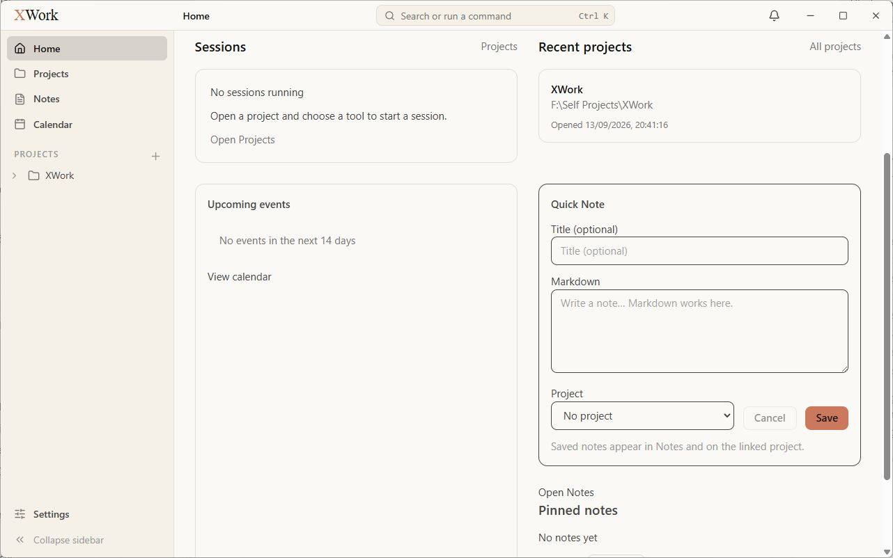
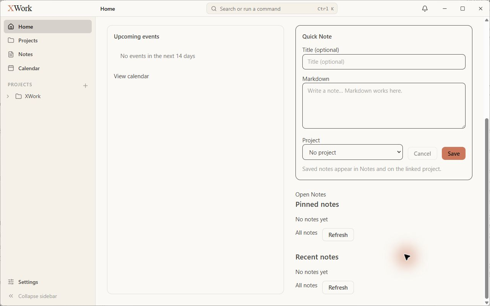
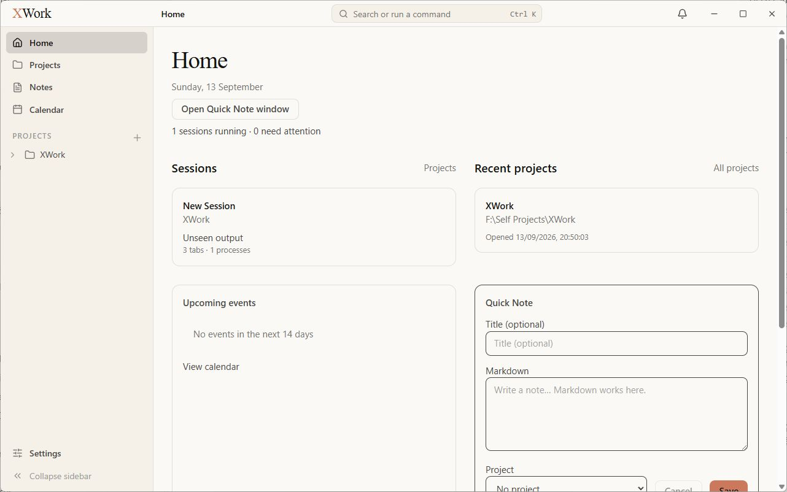
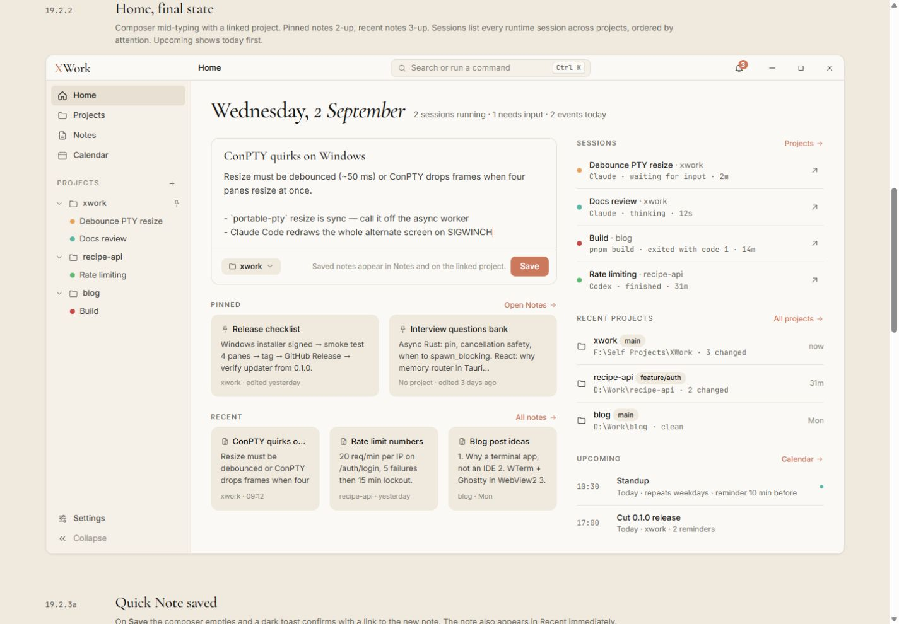

# Home — đối chiếu UI

Ngày kiểm tra: 13/09/2026. Trạng thái: chỉ ghi nhận, chưa sửa. Điều kiện chung và cách hiểu mức độ: [Tổng quan](00-Overview.md).

## Wireframe đối chiếu

- [19.2.1 — Home ít dữ liệu](../../01-Wireframe/03-Home.html#empty)
- [19.2.2 — Bố cục đầy đủ](../../01-Wireframe/03-Home.html#full)

## Các bước đã quan sát

1. Mở Home khi có một dự án, chưa có note/event và chưa chạy session.
2. Chụp đầu trang, cuộn xuống xem composer, Pinned và Recent.
3. Sau khi xem các màn hình khác, quay lại Home để chụp card session và toàn bộ phần cuối trang.

## Điểm chưa khớp

### UI-HOME-01 · P1 — Sai thứ tự và tỷ lệ hai cột chính

- **Hiện tại:** Sessions và Recent projects nằm ở hàng đầu; Upcoming nằm dưới bên trái, Quick Note ở dưới bên phải. Pinned/Recent tiếp tục nằm dưới composer.
- **Wireframe:** Cột trái rộng dành cho composer rồi Notes; cột phải hẹp dành cho Sessions, Recent projects và Upcoming.
- **Ảnh hưởng:** Tác vụ viết ghi chú không xuất hiện ở vị trí ưu tiên; màn hình ít dữ liệu vẫn phải cuộn mới tới nút lưu và các nhóm note.
- **Bằng chứng:** [01-app-home-top](assets/2026-09-13/01-app-home-top.jpg) · [01-ref-home-empty](assets/2026-09-13/01-ref-home-empty.jpg) · [02-app-home-scroll](assets/2026-09-13/02-app-home-scroll.jpg).

### UI-HOME-02 · P2 — Tiêu đề ngày bị thay bằng tiêu đề Home lớn

- **Hiện tại:** Một chữ Home lớn, ngày ở dòng phụ, nút Open Quick Note window ở dòng tiếp theo và trạng thái session thêm một dòng nữa.
- **Wireframe:** Ngày là tiêu đề serif chính; phần tóm tắt chạy cùng hàng với ngày.
- **Ảnh hưởng:** Header chiếm quá nhiều chiều cao và đánh mất điểm nhấn ngày của màn hình.
- **Bằng chứng:** [01-app-home-top](assets/2026-09-13/01-app-home-top.jpg) · [01-ref-home-empty](assets/2026-09-13/01-ref-home-empty.jpg).

### UI-HOME-03 · P2 — Composer trông như biểu mẫu nhiều trường thay vì vùng viết liền mạch

- **Hiện tại:** Có tiêu đề Quick Note, nhãn Title/Markdown/Project riêng, input viền đậm, select lớn và nút Cancel.
- **Wireframe:** Một khung nhẹ gồm title và body liền nhau; footer gọn chứa chip liên kết dự án, giải thích và Save.
- **Ảnh hưởng:** Tăng nhiễu thị giác và làm vùng viết cao hơn đáng kể.
- **Bằng chứng:** [02-app-home-scroll](assets/2026-09-13/02-app-home-scroll.jpg) · [01-ref-home-empty](assets/2026-09-13/01-ref-home-empty.jpg).

### UI-HOME-04 · P2 — Empty state thiếu hình thức và lời dẫn theo mẫu

- **Hiện tại:** Sessions là một card căn trái; Upcoming thành card rất cao có khoảng trắng lớn; Pinned/Recent chỉ là No notes yet kèm All notes và Refresh lặp lại.
- **Wireframe:** Các khung rỗng viền nét đứt, tiêu đề serif căn giữa, giải thích ngắn và hành động tiếp theo rõ ràng; Home rỗng chỉ có một nhóm Notes.
- **Ảnh hưởng:** Khoảng trống không có chủ đích, nhiều nút phụ cạnh tranh và không còn nhịp bố cục của mẫu.
- **Bằng chứng:** [01-app-home-top](assets/2026-09-13/01-app-home-top.jpg) · [02-app-home-scroll](assets/2026-09-13/02-app-home-scroll.jpg) · [01-ref-home-empty](assets/2026-09-13/01-ref-home-empty.jpg) · [38-app-home-bottom](assets/2026-09-13/38-app-home-bottom.jpg).

### UI-HOME-05 · P2 — Recent projects thiếu dòng Git và trình bày quá nặng

- **Hiện tại:** Một card lớn hiển thị tên, đường dẫn và timestamp đầy đủ; không có branch hoặc Git summary trong hàng Home.
- **Wireframe:** Danh sách gọn có icon thư mục, branch, đường dẫn, số thay đổi và thời gian tương đối.
- **Ảnh hưởng:** Khó quét trạng thái dự án; một mục đơn lẻ chiếm nhiều diện tích.
- **Bằng chứng:** [01-app-home-top](assets/2026-09-13/01-app-home-top.jpg) · [01-ref-home-empty](assets/2026-09-13/01-ref-home-empty.jpg).

### UI-HOME-06 · P2 — Session trên Home thành card nhiều dòng thay vì hàng trạng thái gọn

- **Hiện tại:** Session New Session được hiển thị thành card có các dòng tên, project, Unseen output và số tab/process; không có status dot hoặc mũi tên mở ở cuối hàng.
- **Wireframe:** Mẫu dùng danh sách hàng gọn với status dot, tên session + project trên một dòng, thông tin trạng thái phụ và biểu tượng mở.
- **Ảnh hưởng:** Một session đã chiếm nhiều chiều cao, khó quét đồng thời các trạng thái khi có thêm session.
- **Bằng chứng:** [37-app-home-session](assets/2026-09-13/37-app-home-session.jpg) · [37-ref-home-full](assets/2026-09-13/37-ref-home-full.jpg).

## Giới hạn kiểm tra

Không coi số dự án, ngày tháng, số session hoặc việc không có note/event mẫu là lỗi. Chưa kiểm tra card note có nội dung, toast lưu thành công và validation của composer.

## Ảnh đối chiếu

Ảnh app và wireframe được giữ nguyên; ảnh wireframe có phần chú thích ngoài khung ứng dụng.

### 01-app-home-top

### 01-ref-home-empty

### 02-app-home-scroll

### 38-app-home-bottom

### 37-app-home-session

### 37-ref-home-full

