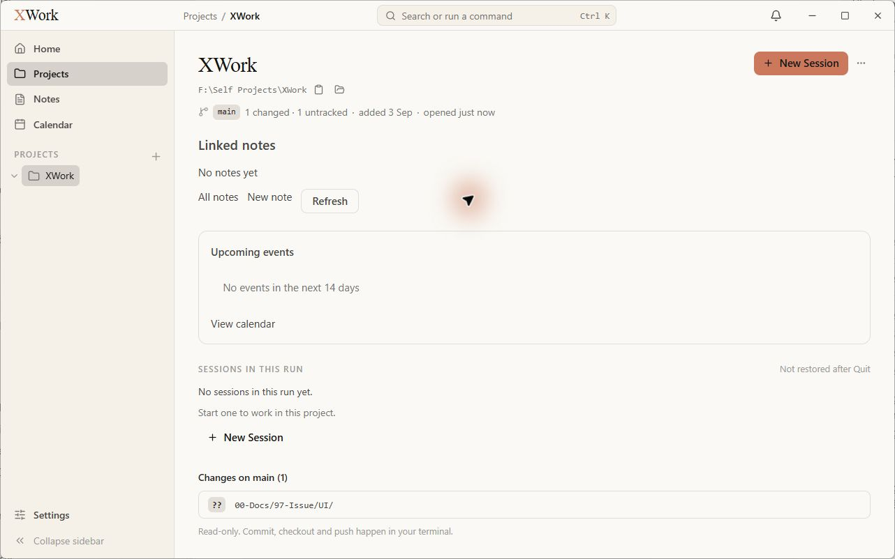
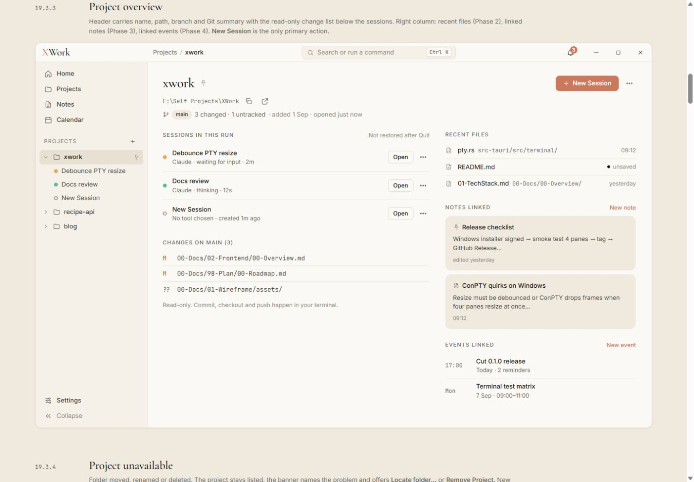

# Danh sách và tổng quan Projects — đối chiếu UI

Ngày kiểm tra: 13/09/2026. Trạng thái: chỉ ghi nhận, chưa sửa. Điều kiện chung và cách hiểu mức độ: [Tổng quan](00-Overview.md).

## Wireframe đối chiếu

- [19.3.1 — Projects grid](../../01-Wireframe/04-Projects.html#grid)
- [19.3.3 — Project overview](../../01-Wireframe/04-Projects.html#overview)

## Các bước đã quan sát

1. Từ sidebar mở Projects và xem card XWork.
2. Bấm Open để xem tổng quan dự án trước khi tạo session phục vụ audit.

## Điểm chưa khớp

### UI-PROJECT-01 · P2 — Grid ở khung cửa sổ chuẩn chỉ phân bổ hai cột

- **Hiện tại:** Card XWork chiếm gần nửa phần nội dung dù mẫu ở 1280 × 800 chia ba cột.
- **Wireframe:** Ba card trên một hàng, tỷ lệ gọn hơn.
- **Ảnh hưởng:** Mật độ danh sách thấp và card đơn rộng, trống. Quan sát tại cấu hình chữ 15 px; chưa đổi về 14 px để kiểm tra breakpoint.
- **Bằng chứng:** [03-app-projects-grid](assets/2026-09-13/03-app-projects-grid.jpg) · [03-ref-projects-grid](assets/2026-09-13/03-ref-projects-grid.jpg).

### UI-PROJECT-02 · P2 — Card thiếu metadata branch, Git và số session

- **Hiện tại:** Card XWork chỉ có tên, đường dẫn, Open và menu; phần giữa trống dù đây là Git repository và trang overview đọc được main.
- **Wireframe:** Card có hàng branch/change count và số session; ngay cả không có session cũng có nhãn No sessions.
- **Ảnh hưởng:** Danh sách không cho thấy thông tin quan trọng đã có ở màn hình chi tiết.
- **Bằng chứng:** [03-app-projects-grid](assets/2026-09-13/03-app-projects-grid.jpg) · [04-app-project-overview](assets/2026-09-13/04-app-project-overview.jpg) · [03-ref-projects-grid](assets/2026-09-13/03-ref-projects-grid.jpg).

### UI-PROJECT-03 · P1 — Overview mất bố cục hai cột và đẩy Sessions xuống cuối

- **Hiện tại:** Linked notes nằm ngay dưới header; Upcoming events là một card ngang toàn trang; Sessions rồi Changes xuất hiện phía dưới.
- **Wireframe:** Sessions và Changes ở cột trái; Recent files, Notes linked, Events linked ở cột phải.
- **Ảnh hưởng:** Nội dung liên quan công việc hiện tại bị đẩy xuống; vùng phụ chiếm gần hết phần đầu màn hình.
- **Bằng chứng:** [04-app-project-overview](assets/2026-09-13/04-app-project-overview.jpg) · [04-ref-project-overview](assets/2026-09-13/04-ref-project-overview.jpg).

### UI-PROJECT-04 · P2 — Các nhóm phụ của overview chưa có cách trình bày như mẫu

- **Hiện tại:** Linked notes chỉ có dòng No notes yet và All notes/New note/Refresh; Events là một card rỗng lớn; không thấy nhóm Recent files hoặc hành động New event trong phần đang hiển thị.
- **Wireframe:** Các nhóm phụ có nhãn nhỏ, hàng/card gọn, liên kết hành động ở góc phải.
- **Ảnh hưởng:** Màn hình thiếu cấu trúc quét thông tin và tạo cảm giác ghép các khối độc lập. Việc có hiện Recent files khi có dữ liệu chưa được xác nhận.
- **Bằng chứng:** [04-app-project-overview](assets/2026-09-13/04-app-project-overview.jpg) · [04-ref-project-overview](assets/2026-09-13/04-ref-project-overview.jpg).

## Giới hạn kiểm tra

Chỉ có một dự án thực tế. Chưa kiểm tra nhiều card, pinned, unavailable, folder picker, relocate, remove hoặc danh sách Git dài; không tạo/xóa dự án để ép những trạng thái này.

## Ảnh đối chiếu

Ảnh app và wireframe được giữ nguyên; ảnh wireframe có phần chú thích ngoài khung ứng dụng.

### 03-app-projects-grid

### 03-ref-projects-grid

### 04-app-project-overview

### 04-ref-project-overview

