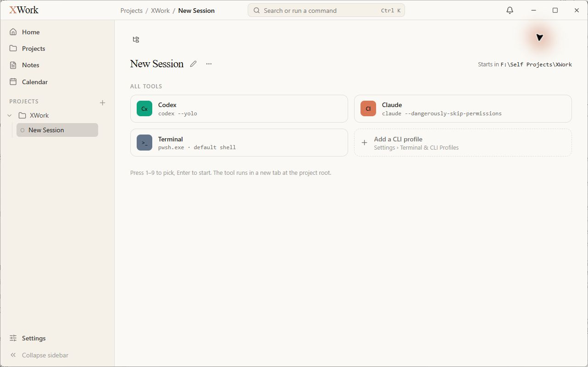
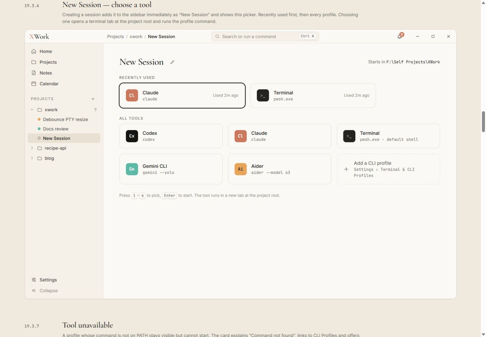
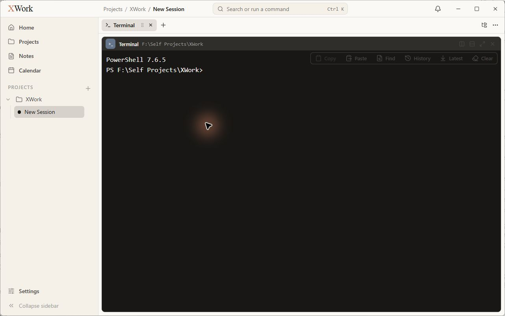
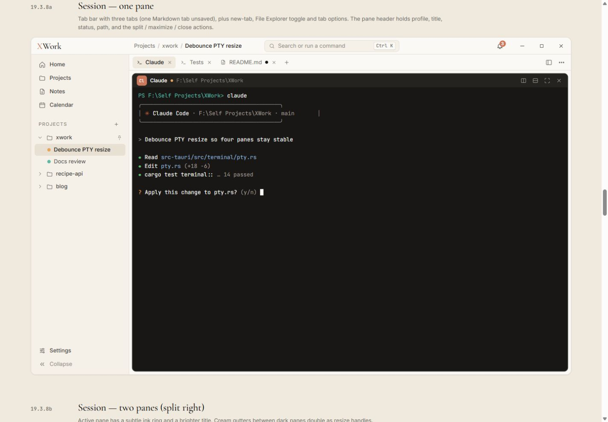
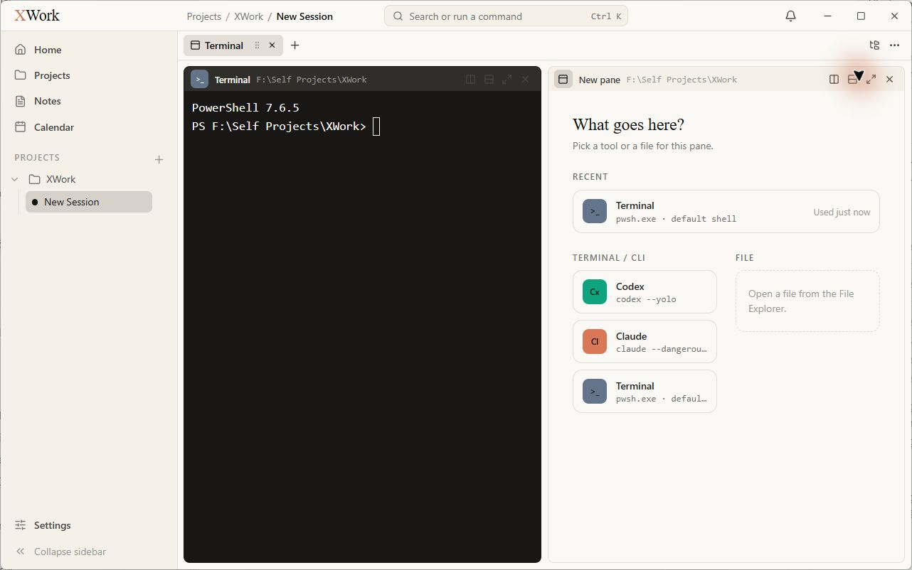
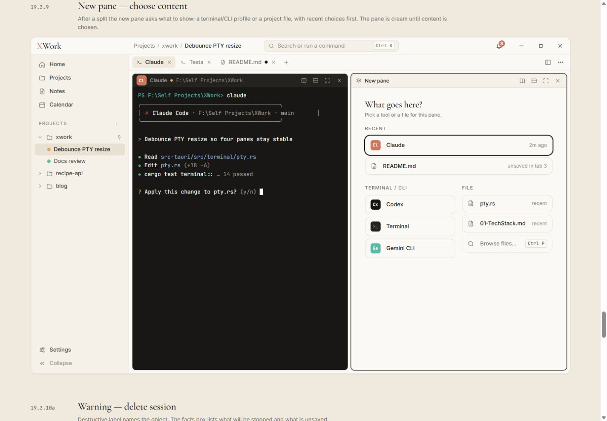

# Sessions, chọn công cụ và chia pane — đối chiếu UI

Ngày kiểm tra: 13/09/2026. Trạng thái: chỉ ghi nhận, chưa sửa. Điều kiện chung và cách hiểu mức độ: [Tổng quan](00-Overview.md).

## Wireframe đối chiếu

- [19.3.6 — New Session](../../01-Wireframe/04-Projects.html#new-session)
- [19.3.8a — Một pane](../../01-Wireframe/04-Projects.html#panes-1)
- [19.3.9 — Chọn nội dung pane](../../01-Wireframe/04-Projects.html#pane-picker)

## Các bước đã quan sát

1. Tại dự án XWork bấm New Session, chụp bộ chọn công cụ.
2. Chọn Terminal để quan sát pane mặc định, không nhập lệnh.
3. Bấm Split right để xem pane trống, rồi bật File Explorer.

## Điểm chưa khớp

### UI-SESSION-01 · P2 — Bộ chọn All tools có tỷ lệ và vị trí khác mẫu

- **Hiện tại:** All tools chỉ có hai cột rộng; phía trên tiêu đề có một hàng cao gần như trống chỉ chứa icon File Explorer.
- **Wireframe:** Mẫu có ba cột cho All tools và tiêu đề nằm gần đầu vùng nội dung.
- **Ảnh hưởng:** Màn hình chọn công cụ dàn trải, lãng phí diện tích trước khi bắt đầu phiên.
- **Bằng chứng:** [05-app-new-session](assets/2026-09-13/05-app-new-session.jpg) · [05-ref-new-session](assets/2026-09-13/05-ref-new-session.jpg).

### UI-SESSION-02 · P2 — Màu dấu công cụ mặc định không khớp

- **Hiện tại:** Codex dùng xanh ngọc đậm; Terminal dùng xanh xám.
- **Wireframe:** Codex dùng ink/đen, Terminal dùng dark-elevated; coral dành cho Claude.
- **Ảnh hưởng:** Nhận diện công cụ và ngôn ngữ màu khác mẫu trên cả bộ chọn lẫn header pane.
- **Bằng chứng:** [05-app-new-session](assets/2026-09-13/05-app-new-session.jpg) · [05-ref-new-session](assets/2026-09-13/05-ref-new-session.jpg) · [06-app-terminal](assets/2026-09-13/06-app-terminal.jpg).

### UI-SESSION-03 · P1 — Điều khiển trên nền Terminal quá tối

- **Hiện tại:** Các icon chia pane, maximize, close và dải Copy/Paste/Find/History/Latest/Clear gần như hòa vào nền tối; accessibility cho thấy nhiều nút vẫn khả dụng.
- **Wireframe:** Nút header trên nền tối có màu đủ nhìn và được phân tách gọn trong header; mẫu không có dải thao tác nổi lớn phủ nội dung.
- **Ảnh hưởng:** Khó nhận ra và sử dụng thao tác pane/Terminal. Đây là rủi ro tương phản nhìn thấy, chưa phải kết quả đo WCAG.
- **Bằng chứng:** [06-app-terminal](assets/2026-09-13/06-app-terminal.jpg) · [06-ref-session-one-pane](assets/2026-09-13/06-ref-session-one-pane.jpg).

### UI-SESSION-04 · P2 — Khu vực FILE trong pane picker chỉ là khung hướng dẫn

- **Hiện tại:** Pane mới có khung nét đứt ghi Open a file from the File Explorer, không có Browse files…; card công cụ nhiều dòng bị cắt mạnh khi bật Explorer.
- **Wireframe:** Mẫu có lựa chọn file gần đây và nút Browse files… với shortcut; các lựa chọn CLI gọn.
- **Ảnh hưởng:** Điểm vào thao tác mở file kém rõ; hướng dẫn tĩnh chiếm chỗ của điều khiển trực tiếp. Không kết luận thiếu recent file vì lúc chụp chưa có file gần đây.
- **Bằng chứng:** [07-app-pane-picker](assets/2026-09-13/07-app-pane-picker.jpg) · [08-app-file-explorer](assets/2026-09-13/08-app-file-explorer.jpg) · [07-ref-pane-picker](assets/2026-09-13/07-ref-pane-picker.jpg).

## Giới hạn kiểm tra

Đã xem một pane Terminal và chia thành hai pane với pane phải trống. Chưa kiểm tra 3–4 pane, maximize/restore, trạng thái CLI đang chạy, tool unavailable hoặc các cảnh báo xóa session/quit. Không chạy Codex/Claude và không gõ lệnh vào Terminal.

## Ảnh đối chiếu

Ảnh app và wireframe được giữ nguyên; ảnh wireframe có phần chú thích ngoài khung ứng dụng.

### 05-app-new-session

### 05-ref-new-session

### 06-app-terminal

### 06-ref-session-one-pane

### 07-app-pane-picker

### 08-app-file-explorer

### 07-ref-pane-picker

