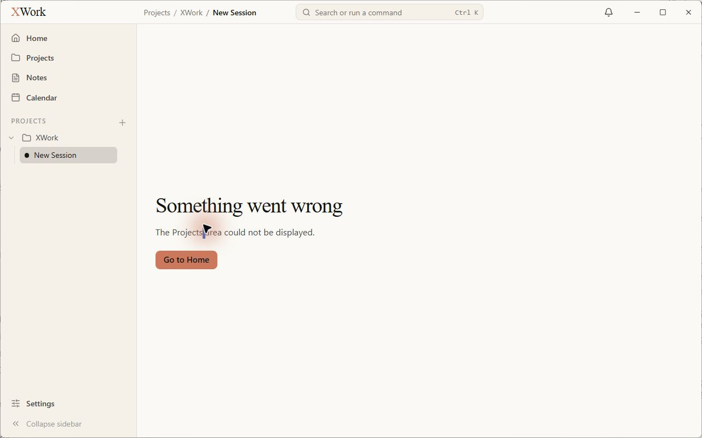
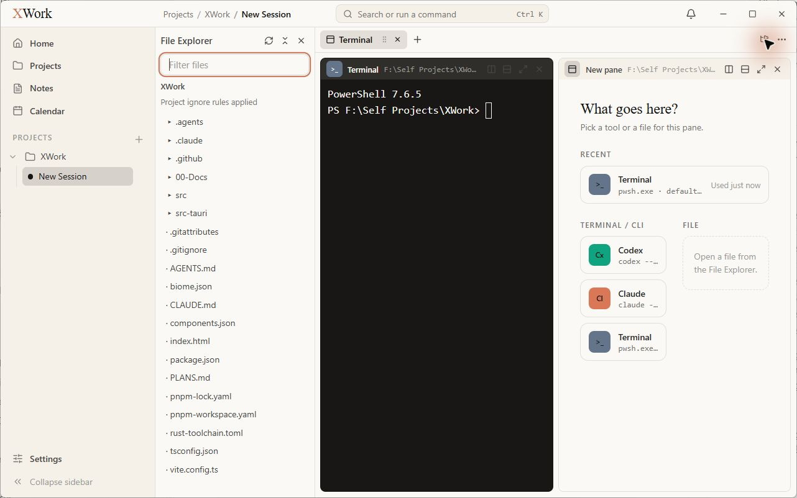
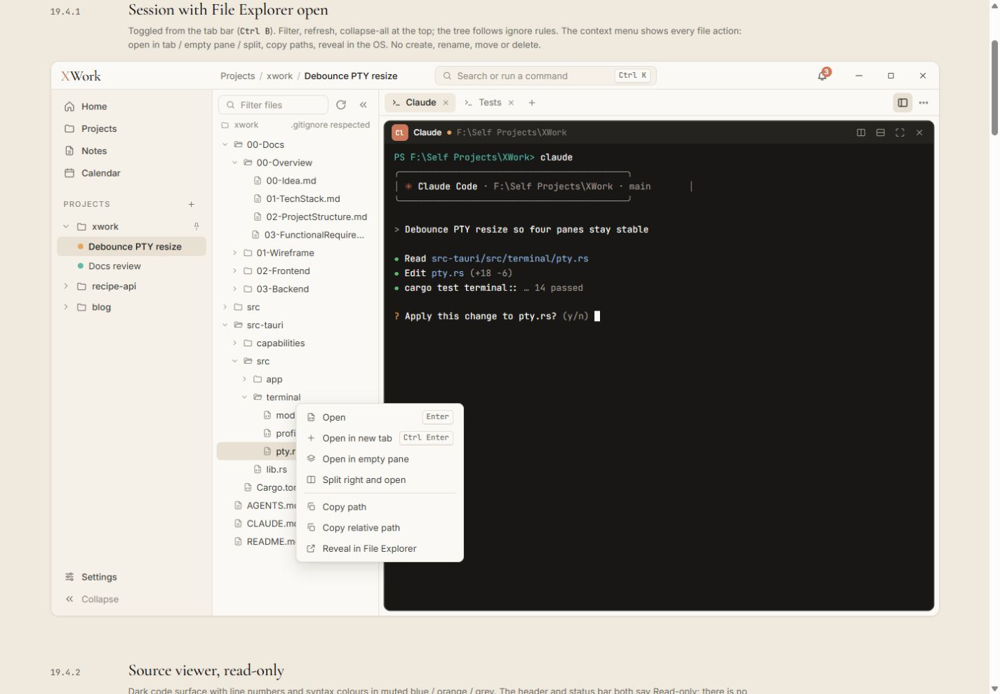
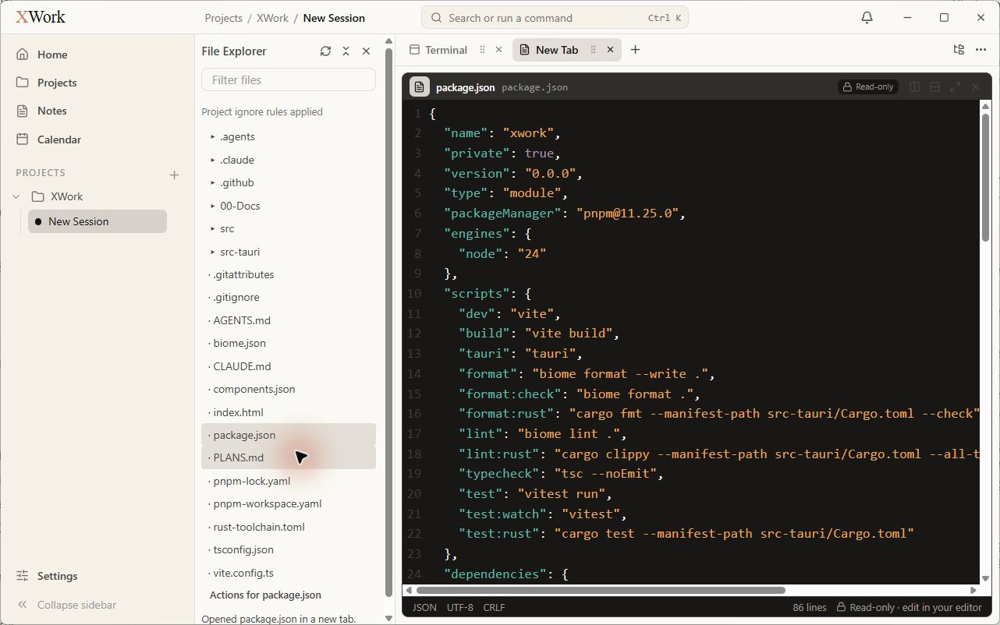
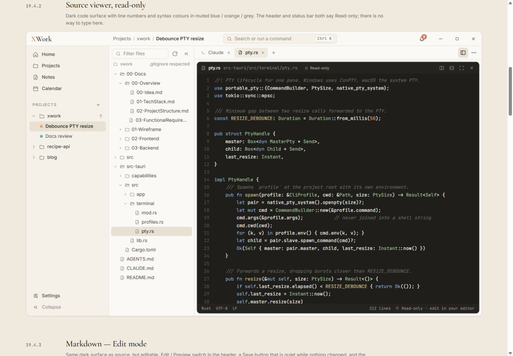

# File Explorer, source viewer và giới hạn Markdown — đối chiếu UI

Ngày kiểm tra: 13/09/2026. Trạng thái: chỉ ghi nhận, chưa sửa. Điều kiện chung và cách hiểu mức độ: [Tổng quan](00-Overview.md).

## Wireframe đối chiếu

- [19.4.1 — File Explorer](../../01-Wireframe/05-Files.html#explorer)
- [19.4.2 — Source viewer](../../01-Wireframe/05-Files.html#source)
- [19.4.3 — Markdown Edit](../../01-Wireframe/05-Files.html#md-edit)
- [19.4.4 — Markdown Preview](../../01-Wireframe/05-Files.html#md-preview)

## Các bước đã quan sát

1. Bật File Explorer trong session vừa tạo.
2. Mở package.json bằng double-click, xem source viewer.
3. Double-click AGENTS.md để mở Markdown và ghi nhận màn hình lỗi.

## Điểm chưa khớp

### UI-FILE-01 · P2 — Cây tệp dùng dấu chấm và tam giác thay cho icon

- **Hiện tại:** Thư mục được biểu diễn bằng tam giác nhỏ; file bắt đầu bằng dấu chấm; thiếu icon folder/file như mẫu.
- **Wireframe:** Cây tệp dùng chevron mở rộng kết hợp icon thư mục hoặc icon loại file.
- **Ảnh hưởng:** Khó phân biệt file và folder khi quét nhanh; cây tệp trông như danh sách văn bản tạm.
- **Bằng chứng:** [08-app-file-explorer](assets/2026-09-13/08-app-file-explorer.jpg) · [08-ref-file-explorer](assets/2026-09-13/08-ref-file-explorer.jpg).

### UI-FILE-02 · P2 — Explorer thêm nhiều hàng chrome và thông báo dài

- **Hiện tại:** Có hàng tiêu đề File Explorer, hàng filter riêng, tên project, dòng Project ignore rules applied; sau mở file có Actions for package.json và dòng xác nhận ở đáy.
- **Wireframe:** Toolbar filter/refresh/collapse gọn ở một hàng, thông tin root/ignore ở hàng phụ; hành động file nằm trong menu.
- **Ảnh hưởng:** Chiếm chiều cao của cây tệp; khi mở file xuất hiện cuộn và thông tin phụ lấn vùng danh sách.
- **Bằng chứng:** [08-app-file-explorer](assets/2026-09-13/08-app-file-explorer.jpg) · [09-app-source-viewer](assets/2026-09-13/09-app-source-viewer.jpg) · [08-ref-file-explorer](assets/2026-09-13/08-ref-file-explorer.jpg).

### UI-FILE-03 · P2 — Tab file vẫn mang tên New Tab

- **Hiện tại:** Header pane xác nhận package.json đang mở nhưng nhãn tab phía trên là New Tab.
- **Wireframe:** Tab source viewer mang tên file đang đọc.
- **Ảnh hưởng:** Không thể nhận diện nội dung từ thanh tab, nhất là khi nhiều file cùng mở.
- **Bằng chứng:** [09-app-source-viewer](assets/2026-09-13/09-app-source-viewer.jpg) · [09-ref-source-viewer](assets/2026-09-13/09-ref-source-viewer.jpg).

### UI-FILE-04 · P2 — Thanh cuộn sáng và số dòng quá tối trên source viewer

- **Hiện tại:** Thanh cuộn ngang/dọc có track trắng sáng, trong khi số dòng chìm vào nền tối.
- **Wireframe:** Mẫu giữ bề mặt editor tối thống nhất, số dòng màu muted đủ để định vị.
- **Ảnh hưởng:** Mảng trắng phá bề mặt tối; định vị dòng khó hơn. Không so màu token JSON với token Rust vì khác ngôn ngữ.
- **Bằng chứng:** [09-app-source-viewer](assets/2026-09-13/09-app-source-viewer.jpg) · [09-ref-source-viewer](assets/2026-09-13/09-ref-source-viewer.jpg).

## Giới hạn kiểm tra

Mở AGENTS.md dẫn đến Something went wrong / The Projects area could not be displayed. Đây là blocker quan sát trong lượt audit, không phải kết luận về nguyên nhân hoặc một lỗi giao diện đã được tái hiện nhiều lần. Không đánh giá Markdown Edit/Preview, unsaved/conflict, binary/too-large từ mã nguồn hay suy đoán. Chưa kiểm tra context menu và toàn bộ hành vi mở file.

Ảnh blocker: 

Sau lỗi đã chuyển được sang Notes/Calendar/Settings; không sửa hoặc lưu nội dung file dự án.

## Ảnh đối chiếu

Ảnh app và wireframe được giữ nguyên; ảnh wireframe có phần chú thích ngoài khung ứng dụng.

### 08-app-file-explorer

### 08-ref-file-explorer

### 09-app-source-viewer

### 09-ref-source-viewer

