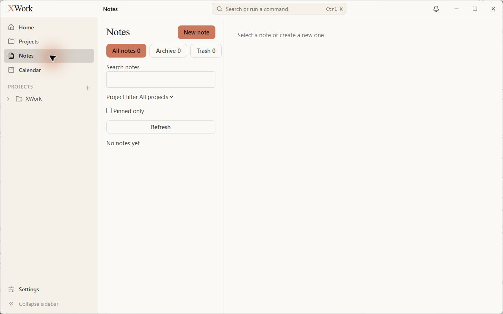
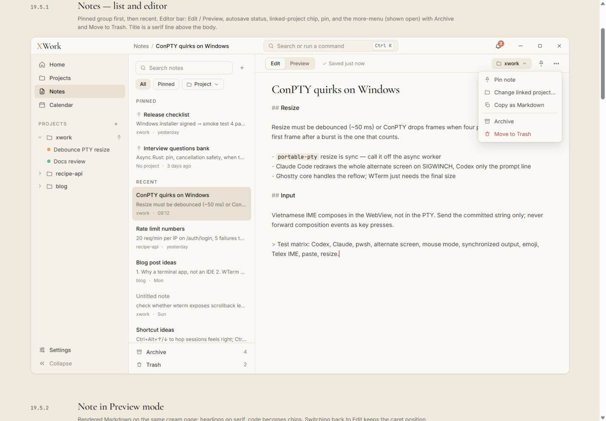
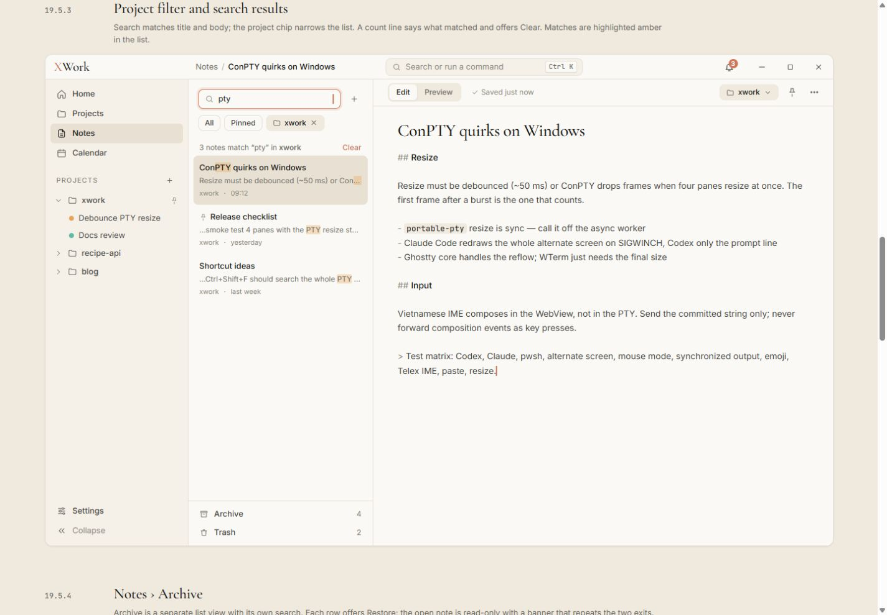
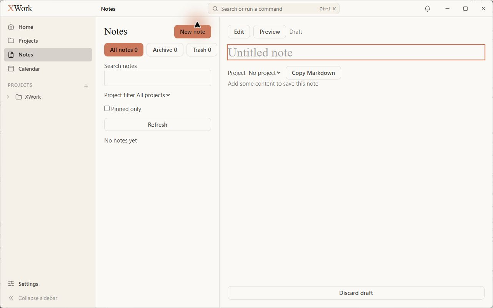
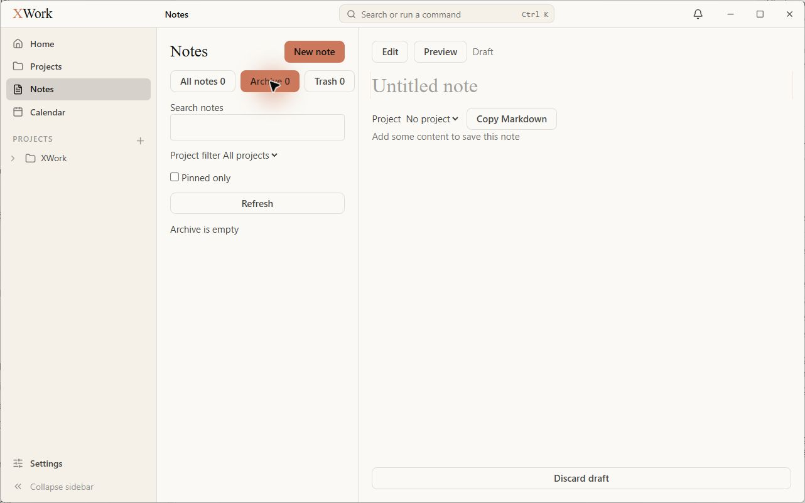
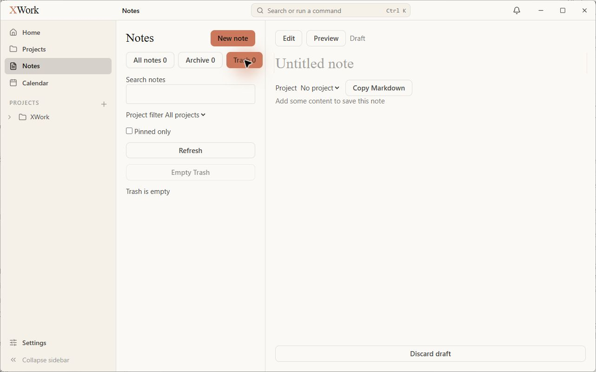

# Notes, Archive và Trash — đối chiếu UI

Ngày kiểm tra: 13/09/2026. Trạng thái: chỉ ghi nhận, chưa sửa. Điều kiện chung và cách hiểu mức độ: [Tổng quan](00-Overview.md).

## Wireframe đối chiếu

- [19.5.1 — List và editor](../../01-Wireframe/06-Notes.html#edit)
- [19.5.3 — Search/filter](../../01-Wireframe/06-Notes.html#search)
- [19.5.4 — Archive](../../01-Wireframe/06-Notes.html#archive)
- [19.5.5 — Trash](../../01-Wireframe/06-Notes.html#trash)

## Các bước đã quan sát

1. Mở Notes khi dữ liệu ghi chú trống.
2. Bấm New note để xem bản nháp rỗng.
3. Chuyển Archive và Trash, không nhập hoặc lưu nội dung.

## Điểm chưa khớp

### UI-NOTE-01 · P2 — Điều hướng Notes và bộ lọc khác hẳn mẫu

- **Hiện tại:** Đầu cột có heading Notes, nút New note lớn và ba nút All notes/Archive/Trash; bên dưới là nhãn search, dropdown Project filter và checkbox Pinned only.
- **Wireframe:** Mẫu ưu tiên hàng search + nút cộng, chip All/Pinned/Project; Archive và Trash cố định ở đáy cột.
- **Ảnh hưởng:** Cột danh sách bị nhiều điều khiển chiếm phần đầu; cấu trúc phân nhóm không còn như mẫu.
- **Bằng chứng:** [11-app-notes-empty](assets/2026-09-13/11-app-notes-empty.jpg) · [11-ref-notes-edit](assets/2026-09-13/11-ref-notes-edit.jpg) · [12-ref-notes-search](assets/2026-09-13/12-ref-notes-search.jpg).

### UI-NOTE-02 · P2 — Refresh toàn chiều rộng và các điều khiển mang kiểu native

- **Hiện tại:** Refresh thành nút ngang lớn; search không có icon; label và giá trị Project filter dính trên một dòng; Pinned only là checkbox vuông.
- **Wireframe:** Filter là các chip gọn có icon và khoảng cách rõ, không có nút Refresh lớn trong bố cục mẫu.
- **Ảnh hưởng:** UI giống biểu mẫu thô hơn danh sách ghi chú; giảm diện tích hiển thị note.
- **Bằng chứng:** [11-app-notes-empty](assets/2026-09-13/11-app-notes-empty.jpg) · [12-ref-notes-search](assets/2026-09-13/12-ref-notes-search.jpg).

### UI-NOTE-03 · P2 — Toolbar editor bị tách thành nhiều hàng không đúng nhóm

- **Hiện tại:** Edit/Preview là hai nút rời; title là ô nhập ngang; Project và Copy Markdown nằm ở hàng dưới title thay vì toolbar.
- **Wireframe:** Toolbar gọn có segmented Edit/Preview, trạng thái lưu, project chip và menu; title serif nằm trong trang viết.
- **Ảnh hưởng:** Phân cấp giữa thao tác, metadata và nội dung yếu; khoảng đầu trang editor chiếm nhiều chỗ.
- **Bằng chứng:** [12-app-notes-draft](assets/2026-09-13/12-app-notes-draft.jpg) · [11-ref-notes-edit](assets/2026-09-13/11-ref-notes-edit.jpg).

### UI-NOTE-04 · P2 — Trạng thái đang chọn dùng coral mạnh và Archive/Trash vẫn hiện bản nháp bên cạnh

- **Hiện tại:** Archive hoặc Trash được tô coral như hành động chính; vùng phải tiếp tục hiển thị bản nháp Untitled note và Discard draft khi danh sách Archive/Trash trống.
- **Wireframe:** Điều hướng và lựa chọn dùng nền kem; Archive/Trash trong mẫu có ngữ cảnh riêng cho nội dung đang xem.
- **Ảnh hưởng:** Không rõ vùng editor thuộc tập ghi chú nào; màu nhấn điều hướng cạnh tranh với nút New note. Chỉ kết luận cho trạng thái bản nháp rỗng đã quan sát.
- **Bằng chứng:** [13-app-notes-archive](assets/2026-09-13/13-app-notes-archive.jpg) · [14-app-notes-trash](assets/2026-09-13/14-app-notes-trash.jpg) · [11-ref-notes-edit](assets/2026-09-13/11-ref-notes-edit.jpg).

## Giới hạn kiểm tra

Không có ghi chú đã lưu nên chưa kiểm tra list item có nội dung, pin, search có kết quả, autosave, Markdown preview hoặc banner read-only của note archived/trashed. Không coi việc chưa thấy menu pin/archive trong bản nháp rỗng là lỗi thiếu chức năng.

## Ảnh đối chiếu

Ảnh app và wireframe được giữ nguyên; ảnh wireframe có phần chú thích ngoài khung ứng dụng.

### 11-app-notes-empty

### 11-ref-notes-edit

### 12-ref-notes-search

### 12-app-notes-draft

### 13-app-notes-archive

### 14-app-notes-trash

