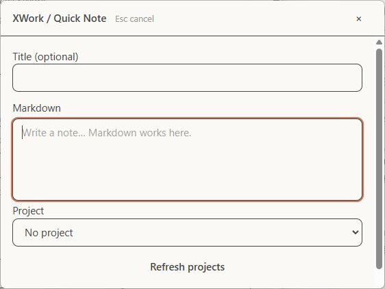
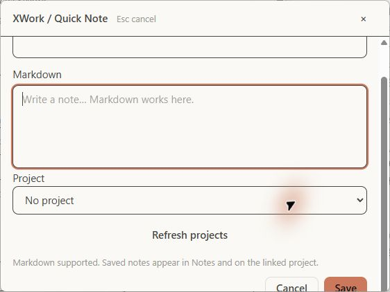
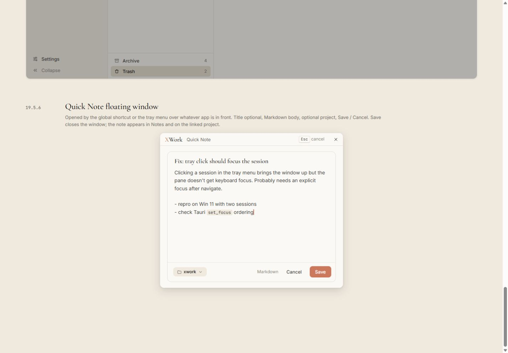

# Cửa sổ nổi Quick Note — đối chiếu UI

Ngày kiểm tra: 13/09/2026. Trạng thái: chỉ ghi nhận, chưa sửa. Điều kiện chung và cách hiểu mức độ: [Tổng quan](00-Overview.md).

## Wireframe đối chiếu

- [19.5.6 — Quick Note floating window](../../01-Wireframe/06-Notes.html#quick-note)

## Các bước đã quan sát

1. Tại Home bấm Open Quick Note window.
2. Chụp lúc mở và sau khi cuộn xuống cuối.
3. Đóng cửa sổ rỗng, không lưu ghi chú.

## Điểm chưa khớp

### UI-QUICK-01 · P1 — Save và Cancel nằm ngoài vùng nhìn, vẫn bị cắt khi cuộn xuống

- **Hiện tại:** Cửa sổ thực tế khoảng 562 × 422 px. Lúc mở không thấy Save/Cancel; sau cuộn xuống, chỉ thấy phần trên hai nút ở mép dưới.
- **Wireframe:** Mẫu cửa sổ 520 × 440 có footer chứa Save/Cancel hiển thị đầy đủ ngay trong khung.
- **Ảnh hưởng:** Tác vụ ghi nhanh bị gián đoạn; hành động hoàn tất khó tiếp cận. Xác nhận ở cấu hình UI 15 px hiện tại.
- **Bằng chứng:** [35-app-quick-note-top](assets/2026-09-13/35-app-quick-note-top.jpg) · [36-app-quick-note-bottom](assets/2026-09-13/36-app-quick-note-bottom.jpg) · [35-ref-quick-note](assets/2026-09-13/35-ref-quick-note.jpg).

### UI-QUICK-02 · P2 — Vùng viết bị chia thành biểu mẫu chiếm nhiều chiều cao

- **Hiện tại:** Title, Markdown và Project có nhãn và viền đậm riêng; có thêm nút Refresh projects và đoạn giải thích dài.
- **Wireframe:** Một vùng viết liền mạch, title serif, body chiếm phần lớn cửa sổ; project chip nằm trong footer.
- **Ảnh hưởng:** Diện tích viết ít hơn, cần cuộn dù ghi chú chưa có nội dung.
- **Bằng chứng:** [35-app-quick-note-top](assets/2026-09-13/35-app-quick-note-top.jpg) · [36-app-quick-note-bottom](assets/2026-09-13/36-app-quick-note-bottom.jpg) · [35-ref-quick-note](assets/2026-09-13/35-ref-quick-note.jpg).

### UI-QUICK-03 · P2 — Header không giữ wordmark và nhịp chrome của mẫu

- **Hiện tại:** Header là chữ sans XWork / Quick Note, đường phân cách đậm và cao; Esc cancel không được trình bày thành phím.
- **Wireframe:** Mẫu có wordmark serif với X coral, nhãn Quick Note riêng và chip Esc ở phía phải.
- **Ảnh hưởng:** Cửa sổ nổi mất nhận diện chung và trông nặng hơn wireframe.
- **Bằng chứng:** [35-app-quick-note-top](assets/2026-09-13/35-app-quick-note-top.jpg) · [35-ref-quick-note](assets/2026-09-13/35-ref-quick-note.jpg).

## Giới hạn kiểm tra

Không lưu note, không kiểm tra xác nhận hủy khi có nội dung, chọn project có dữ liệu hoặc shortcut toàn cục. Kích thước thực tế và font khác mẫu được ghi rõ; không giả định đã kiểm tra mọi mức scale.

## Ảnh đối chiếu

Ảnh app và wireframe được giữ nguyên; ảnh wireframe có phần chú thích ngoài khung ứng dụng.

### 35-app-quick-note-top

### 36-app-quick-note-bottom

### 35-ref-quick-note

