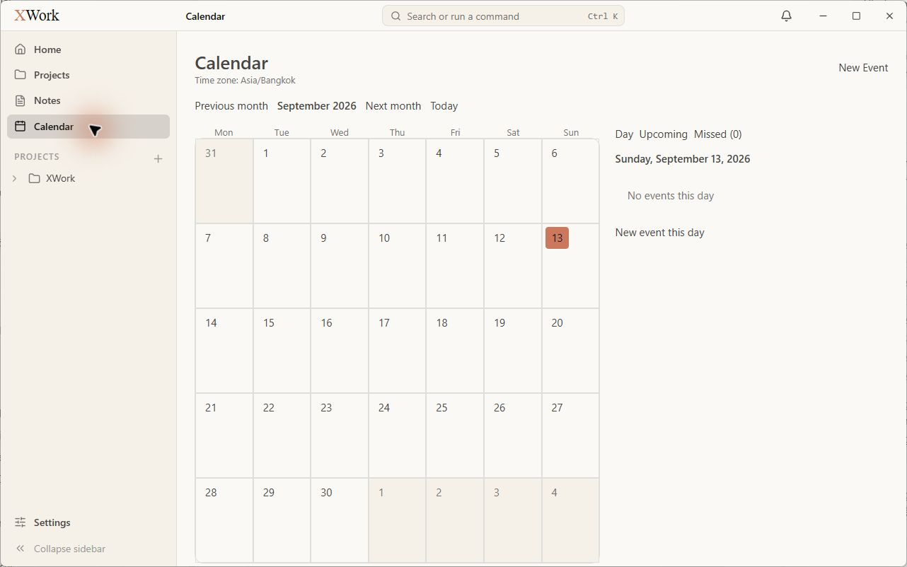
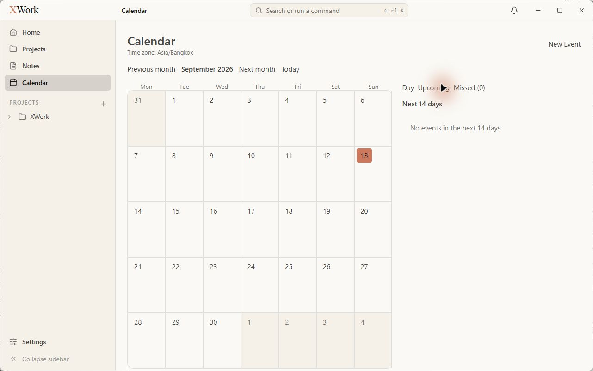
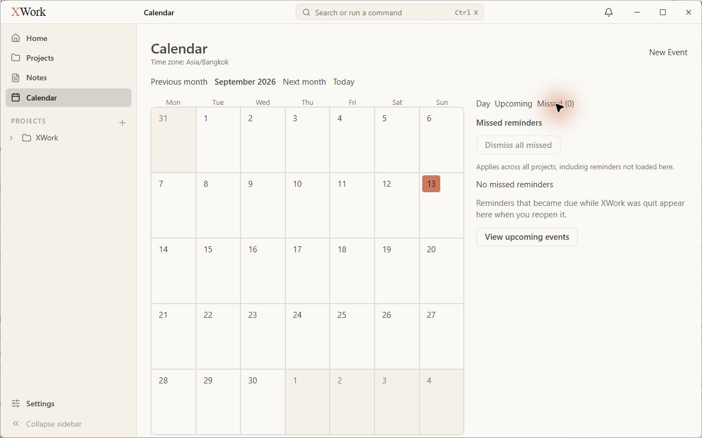
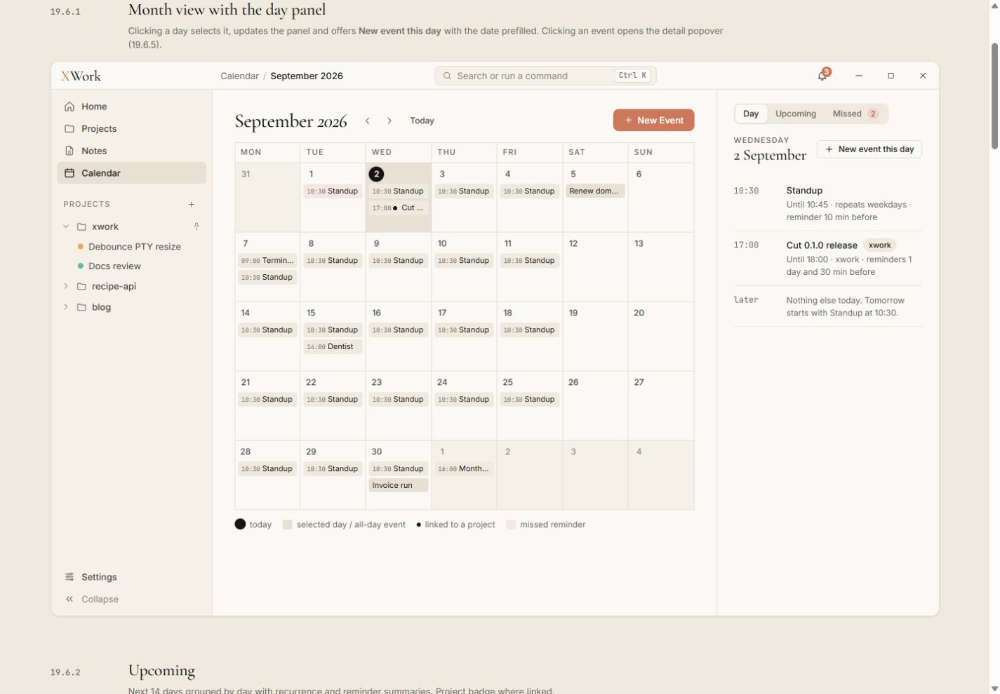
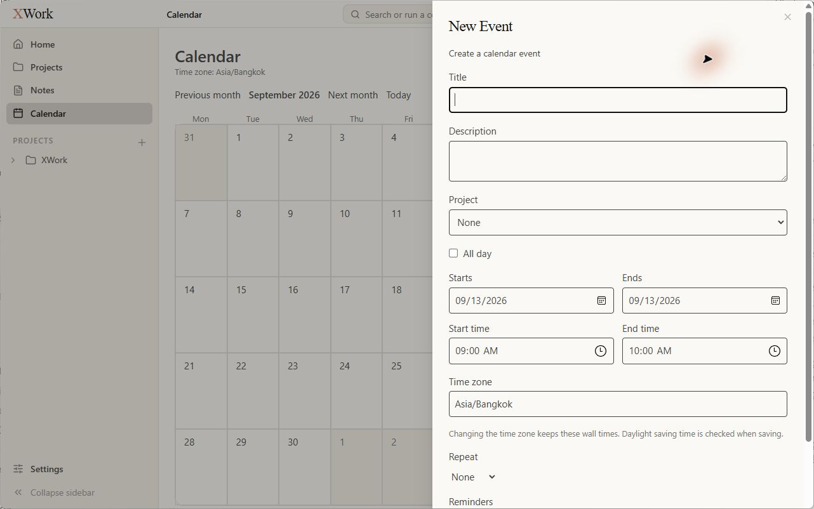
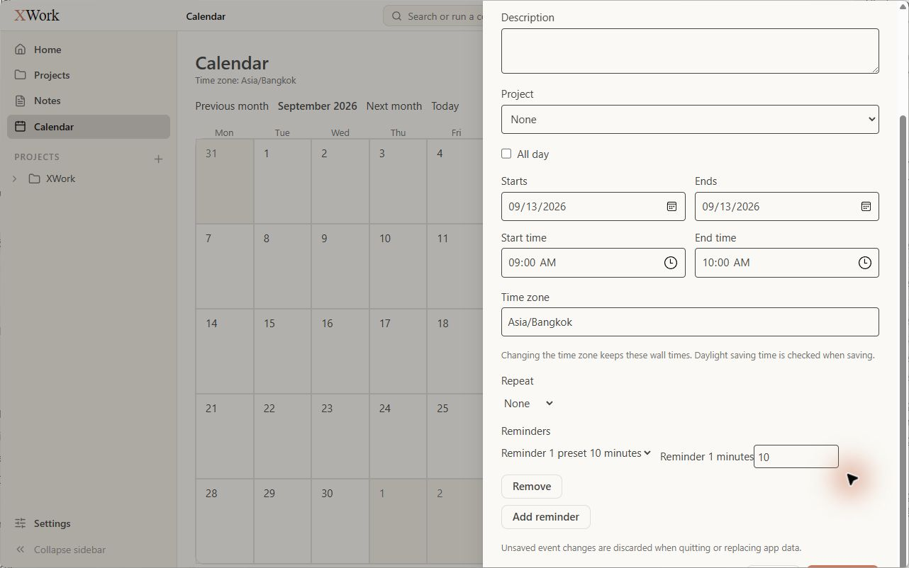
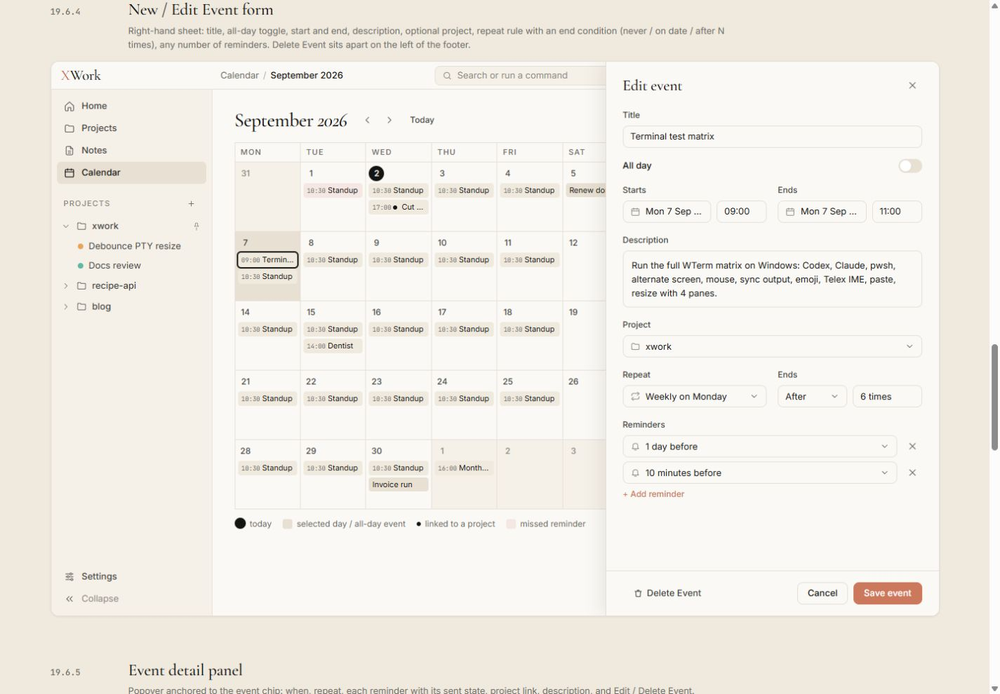
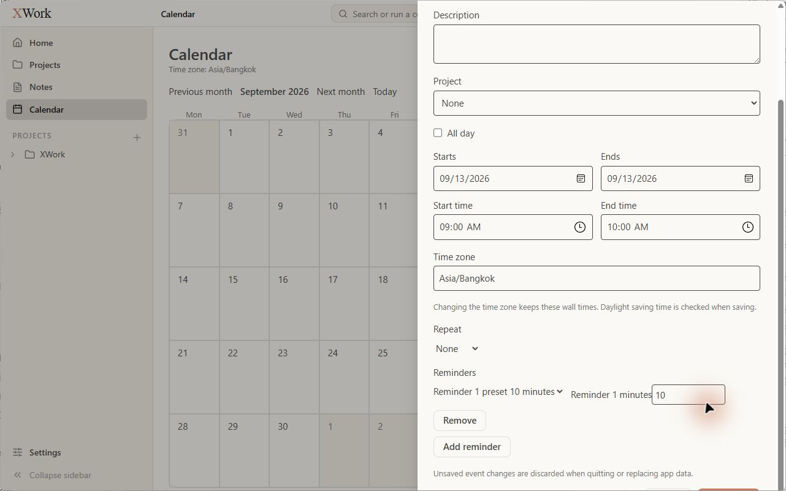

# Calendar và biểu mẫu sự kiện — đối chiếu UI

Ngày kiểm tra: 13/09/2026. Trạng thái: chỉ ghi nhận, chưa sửa. Điều kiện chung và cách hiểu mức độ: [Tổng quan](00-Overview.md).

## Wireframe đối chiếu

- [19.6.1 — Month/Day](../../01-Wireframe/07-Calendar.html#month)
- [19.6.2 — Upcoming](../../01-Wireframe/07-Calendar.html#upcoming)
- [19.6.3 — Missed](../../01-Wireframe/07-Calendar.html#missed)
- [19.6.4 — Event form](../../01-Wireframe/07-Calendar.html#form)

## Các bước đã quan sát

1. Mở Calendar ở September 2026, chọn ngày hiện tại đã được app mặc định.
2. Mở New Event; cuộn đến phần reminders và cuối form; đóng bằng Escape.
3. Chuyển Upcoming và Missed, không tạo event hoặc reminder.

## Điểm chưa khớp

### UI-CAL-01 · P1 — Nhiều điều khiển lịch không có hình thức của nút hoặc segmented control

- **Hiện tại:** Previous month/Next month/Today và New Event trông như chữ thường; Day/Upcoming/Missed là ba nhãn sát nhau, không có nền hoặc trạng thái chọn rõ.
- **Wireframe:** Mẫu có chevron điều hướng, nút New Event coral và segmented control nền kem với tab active.
- **Ảnh hưởng:** Khó nhận ra nơi bấm và không rõ panel đang ở chế độ nào nếu không đọc tiêu đề phụ.
- **Bằng chứng:** [15-app-calendar-month](assets/2026-09-13/15-app-calendar-month.jpg) · [19-app-calendar-upcoming](assets/2026-09-13/19-app-calendar-upcoming.jpg) · [20-app-calendar-missed](assets/2026-09-13/20-app-calendar-missed.jpg) · [15-ref-calendar-month](assets/2026-09-13/15-ref-calendar-month.jpg).

### UI-CAL-02 · P2 — Sai phân cấp header và tỷ lệ vùng lịch/panel

- **Hiện tại:** Calendar là heading sans lớn, timezone nằm dưới; tháng chỉ là chữ nhỏ giữa Previous/Next. Panel phải không có đường ngăn dọc như mẫu.
- **Wireframe:** Tháng là heading serif chính; breadcrumb có tháng, panel phải phân cách và căn theo hàng toolbar.
- **Ảnh hưởng:** Màn hình mất điểm nhấn tháng và cấu trúc hai vùng rõ ràng.
- **Bằng chứng:** [15-app-calendar-month](assets/2026-09-13/15-app-calendar-month.jpg) · [15-ref-calendar-month](assets/2026-09-13/15-ref-calendar-month.jpg).

### UI-CAL-03 · P2 — Ký hiệu today/selected không đúng và thiếu chú giải

- **Hiện tại:** Ngày 13 có nền coral dạng vuông; không có hàng chú giải ở đáy lịch.
- **Wireframe:** Today là vòng tròn ink, ô selected dùng kem đậm; phía dưới có legend cho today/selected/project/missed.
- **Ảnh hưởng:** Màu nhấn không theo quy ước, người dùng không có chú giải để đọc trạng thái lịch.
- **Bằng chứng:** [15-app-calendar-month](assets/2026-09-13/15-app-calendar-month.jpg) · [15-ref-calendar-month](assets/2026-09-13/15-ref-calendar-month.jpg).

### UI-CAL-04 · P1 — Footer biểu mẫu New Event bị khuất và không giữ trong khung

- **Hiện tại:** Form có thanh cuộn dài; Save/Cancel không xuất hiện khi mở. Ở ảnh sau hai lần cuộn xuống chỉ còn thấy mép nút phía dưới, header/Close cũng đã cuộn đi.
- **Wireframe:** Sheet có footer cố định, Save event và Cancel luôn hiện đầy đủ; header có nút đóng dễ thấy.
- **Ảnh hưởng:** Khó hoàn tất hoặc thoát biểu mẫu. Đây là quan sát tại 1280 × 800, UI 15 px; không suy ra lỗi lưu dữ liệu.
- **Bằng chứng:** [16-app-calendar-form-top](assets/2026-09-13/16-app-calendar-form-top.jpg) · [18-app-calendar-form-bottom](assets/2026-09-13/18-app-calendar-form-bottom.jpg) · [16-ref-calendar-form](assets/2026-09-13/16-ref-calendar-form.jpg).

### UI-CAL-05 · P2 — Thứ tự trường và mật độ biểu mẫu khác mẫu

- **Hiện tại:** Description và Project lên trước All day; ngày và giờ tách thành hai hàng; Time zone cùng lời giải thích thành một khối cao.
- **Wireframe:** Title → All day → Starts/Ends → Description → Project → Repeat/Ends → Reminders; bố cục mẫu gọn trong một sheet.
- **Ảnh hưởng:** Làm form dài và khó quét trình tự thời gian; các khác biệt không chỉ do cỡ chữ.
- **Bằng chứng:** [16-app-calendar-form-top](assets/2026-09-13/16-app-calendar-form-top.jpg) · [16-ref-calendar-form](assets/2026-09-13/16-ref-calendar-form.jpg).

### UI-CAL-06 · P2 — Repeat và Reminders hiện như trường kỹ thuật thô

- **Hiện tại:** Repeat là chữ None kèm mũi tên; dòng reminder ghép Reminder 1 preset, 10 minutes, Reminder 1 minutes và ô số; Remove xuống hàng riêng.
- **Wireframe:** Các dòng reminder là select gọn có icon chuông, giá trị thân thiện và nút X trên cùng hàng; Repeat/Ends được nhóm rõ.
- **Ảnh hưởng:** Nhãn trùng lặp, khó đọc và mật độ lộn xộn so với mẫu.
- **Bằng chứng:** [17-app-calendar-form-middle](assets/2026-09-13/17-app-calendar-form-middle.jpg) · [16-ref-calendar-form](assets/2026-09-13/16-ref-calendar-form.jpg).

## Giới hạn kiểm tra

Không có event thật nên chưa xác minh event chip, detail popover, recurrence có dữ liệu, danh sách Upcoming/Missed có mục, reminder toast/OS notification hoặc tác động của Save. Không đưa việc thiếu dữ liệu mẫu vào danh sách lỗi.

## Ảnh đối chiếu

Ảnh app và wireframe được giữ nguyên; ảnh wireframe có phần chú thích ngoài khung ứng dụng.

### 15-app-calendar-month

### 19-app-calendar-upcoming

### 20-app-calendar-missed

### 15-ref-calendar-month

### 16-app-calendar-form-top

### 18-app-calendar-form-bottom

### 16-ref-calendar-form

### 17-app-calendar-form-middle

