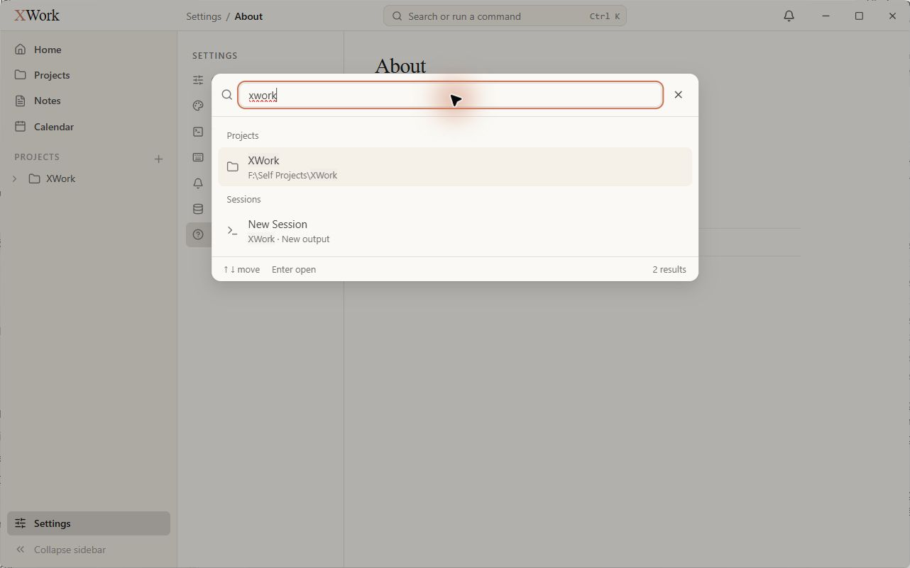
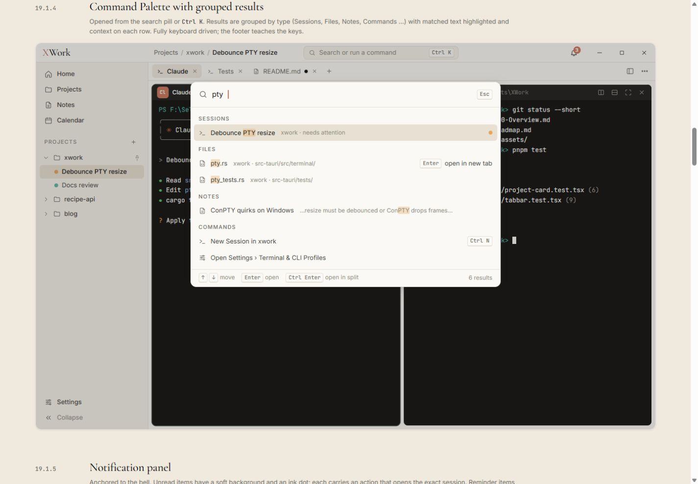
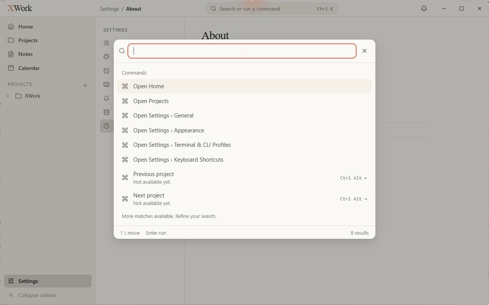

# Command Palette — đối chiếu UI

Ngày kiểm tra: 13/09/2026. Trạng thái: chỉ ghi nhận, chưa sửa. Điều kiện chung và cách hiểu mức độ: [Tổng quan](00-Overview.md).

## Wireframe đối chiếu

- [19.1.4 — Kết quả tìm kiếm theo nhóm](../../01-Wireframe/02-AppShell.html#palette)

## Các bước đã quan sát

1. Bấm search pill từ Settings/About, chụp trạng thái chưa nhập.
2. Nhập xwork, chụp kết quả Projects và Sessions, rồi đóng bằng Escape.

## Điểm chưa khớp

### UI-SEARCH-01 · P2 — Không làm nổi bật phần khớp truy vấn trong kết quả

- **Hiện tại:** XWork trong tên dự án và phần ngữ cảnh session không có nền highlight khi nhập xwork.
- **Wireframe:** Mẫu tô nền amber nhạt cho đoạn khớp trong title hoặc nội dung.
- **Ảnh hưởng:** Khó thấy vì sao kết quả khớp và quét nhanh các hàng gần giống nhau.
- **Bằng chứng:** [32-app-command-palette-results](assets/2026-09-13/32-app-command-palette-results.jpg) · [31-ref-command-palette](assets/2026-09-13/31-ref-command-palette.jpg).

### UI-SEARCH-02 · P2 — Phím hướng dẫn không được thể hiện như phím

- **Hiện tại:** Footer chỉ có chuỗi ↑ ↓ move / Enter open hoặc Enter run; nút đóng là X. Ô search còn hiển thị gạch đỏ kiểm tra chính tả dưới xwork.
- **Wireframe:** Mẫu dùng chip Esc, ↑/↓, Enter và Ctrl Enter, không có gạch lỗi chính tả cho truy vấn kỹ thuật.
- **Ảnh hưởng:** Khả năng nhận diện shortcut yếu và truy vấn hợp lệ trông như có lỗi.
- **Bằng chứng:** [31-app-command-palette-empty](assets/2026-09-13/31-app-command-palette-empty.jpg) · [32-app-command-palette-results](assets/2026-09-13/32-app-command-palette-results.jpg) · [31-ref-command-palette](assets/2026-09-13/31-ref-command-palette.jpg).

### UI-SEARCH-03 · P2 — Danh sách mặc định dành diện tích lớn cho lệnh chưa dùng được

- **Hiện tại:** Previous project và Next project nằm trong 8 kết quả đầu kèm Not available yet; tất cả command dùng cùng một biểu tượng.
- **Wireframe:** Mẫu ưu tiên kết quả/hành động hữu dụng, icon phản ánh loại nội dung hoặc lệnh, header nhóm dạng nhãn nhỏ.
- **Ảnh hưởng:** Bảng lệnh mở lên trông chưa hoàn thiện; lựa chọn hữu ích bị đẩy khỏi nhóm kết quả đầu.
- **Bằng chứng:** [31-app-command-palette-empty](assets/2026-09-13/31-app-command-palette-empty.jpg) · [31-ref-command-palette](assets/2026-09-13/31-ref-command-palette.jpg).

## Giới hạn kiểm tra

Đã xác nhận có nhóm Projects và Sessions; không coi thứ tự nhóm khác mẫu là lỗi khi truy vấn/dữ liệu khác nhau. Chưa kiểm tra tìm file/note/event, mở kết quả, dùng phím điều hướng hoặc Ctrl Enter.

## Ảnh đối chiếu

Ảnh app và wireframe được giữ nguyên; ảnh wireframe có phần chú thích ngoài khung ứng dụng.

### 32-app-command-palette-results

### 31-ref-command-palette

### 31-app-command-palette-empty

