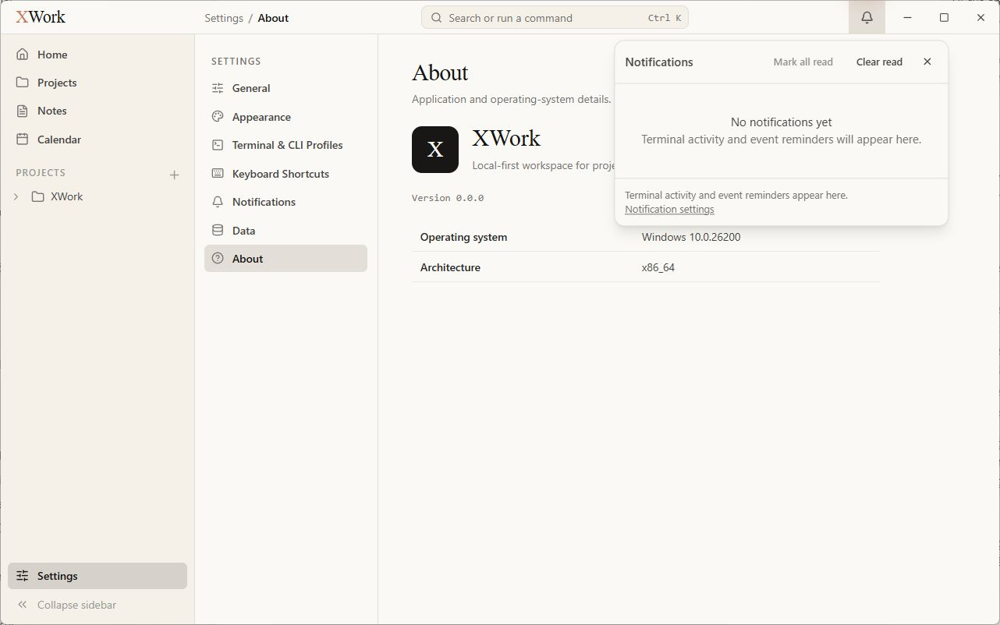
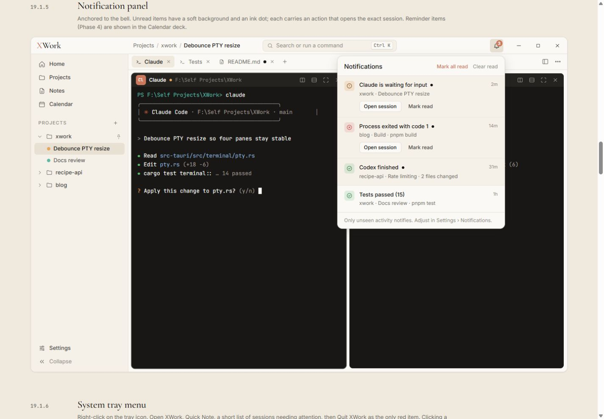

# Bảng thông báo ở biểu tượng chuông — đối chiếu UI

Ngày kiểm tra: 13/09/2026. Trạng thái: chỉ ghi nhận, chưa sửa. Điều kiện chung và cách hiểu mức độ: [Tổng quan](00-Overview.md).

## Wireframe đối chiếu

- [19.1.5 — Notification panel](../../01-Wireframe/02-AppShell.html#notifications)

## Các bước đã quan sát

1. Mở biểu tượng chuông khi chưa có thông báo.
2. Chụp bảng rỗng và đóng lại, không tác động các thiết lập.

## Điểm chưa khớp

### UI-BELL-01 · P3 — Thông điệp empty state và footer bị lặp

- **Hiện tại:** Giữa panel có Terminal activity and event reminders will appear here; footer lặp Terminal activity and event reminders appear here rồi thêm link gạch chân.
- **Wireframe:** Mẫu dùng footer ngắn nói về điều kiện thông báo và dẫn tới Settings, không lặp nội dung thân panel.
- **Ảnh hưởng:** Panel rỗng nhiều chữ thừa, footer thiếu gọn gàng và hierarchy.
- **Bằng chứng:** [33-app-notifications-empty](assets/2026-09-13/33-app-notifications-empty.jpg) · [33-ref-notifications](assets/2026-09-13/33-ref-notifications.jpg).

## Giới hạn kiểm tra

Không có notification nên chưa so sánh unread dot, màu từng loại trạng thái, thời gian, hành động theo session/event và snooze. Không kết luận thiếu badge số khi unread = 0.

## Ảnh đối chiếu

Ảnh app và wireframe được giữ nguyên; ảnh wireframe có phần chú thích ngoài khung ứng dụng.

### 33-app-notifications-empty

### 33-ref-notifications

