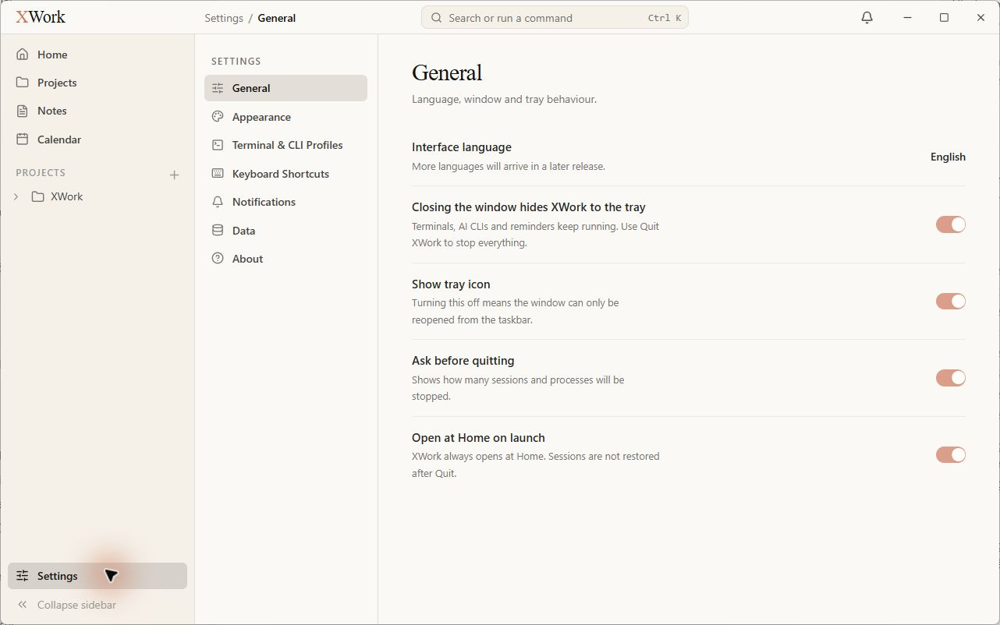
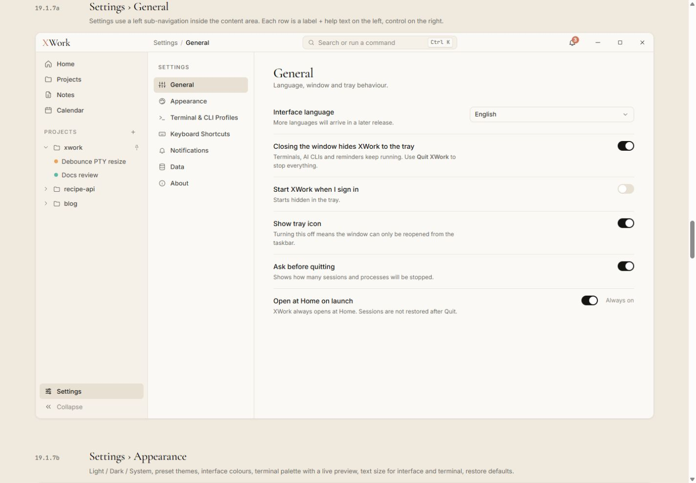

# Settings — General — đối chiếu UI

Ngày kiểm tra: 13/09/2026. Trạng thái: chỉ ghi nhận, chưa sửa. Điều kiện chung và cách hiểu mức độ: [Tổng quan](00-Overview.md).

## Wireframe đối chiếu

- [19.1.7a — General](../../01-Wireframe/02-AppShell.html#settings-general)

## Các bước đã quan sát

1. Mở Settings → General và quan sát toàn trang mà không thay đổi giá trị.

## Điểm chưa khớp

### UI-GENERAL-01 · P2 — Switch bật dùng coral nhạt và trạng thái cố định chưa rõ

- **Hiện tại:** Các switch đang bật màu coral nhạt; Open at Home on launch không có nhãn Always on đi kèm.
- **Wireframe:** Switch bật là ink/đen, trạng thái cố định có Always on.
- **Ảnh hưởng:** Màu coral được dùng rộng ngoài CTA; trạng thái khóa và trạng thái có thể chỉnh khó phân biệt bằng mắt.
- **Bằng chứng:** [21-app-settings-general](assets/2026-09-13/21-app-settings-general.jpg) · [21-ref-settings-general](assets/2026-09-13/21-ref-settings-general.jpg).

### UI-GENERAL-02 · P2 — Thiếu hàng cài đặt và hình thức trường ngôn ngữ trong mẫu

- **Hiện tại:** Không thấy Start XWork when I sign in; Interface language chỉ hiện chữ English bên phải.
- **Wireframe:** Mẫu có hàng startup riêng và trường chọn English có viền/mũi tên.
- **Ảnh hưởng:** Màn hình không khớp nội dung và cân bằng hàng điều khiển trong wireframe. Cần phân biệt phần chưa triển khai/chủ ý sản phẩm với lỗi styling trước khi thực hiện sửa sau này.
- **Bằng chứng:** [21-app-settings-general](assets/2026-09-13/21-app-settings-general.jpg) · [21-ref-settings-general](assets/2026-09-13/21-ref-settings-general.jpg).

## Giới hạn kiểm tra

Không bật/tắt switch, không kiểm tra autostart hay hành vi hệ thống. Chỉ ghi chênh lệch hiển thị; không khẳng định các chức năng thiếu ở backend.

## Ảnh đối chiếu

Ảnh app và wireframe được giữ nguyên; ảnh wireframe có phần chú thích ngoài khung ứng dụng.

### 21-app-settings-general

### 21-ref-settings-general

