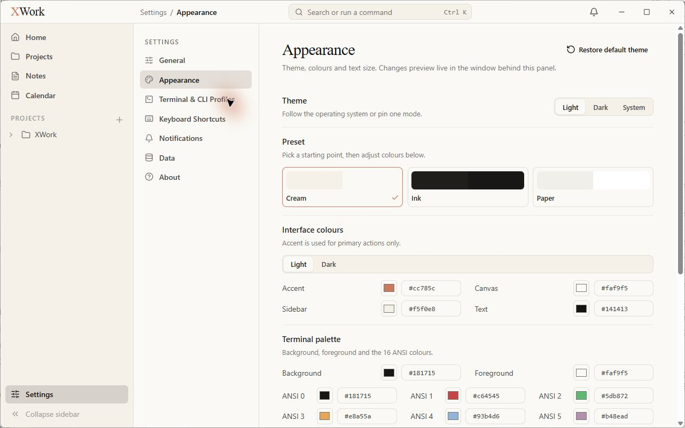
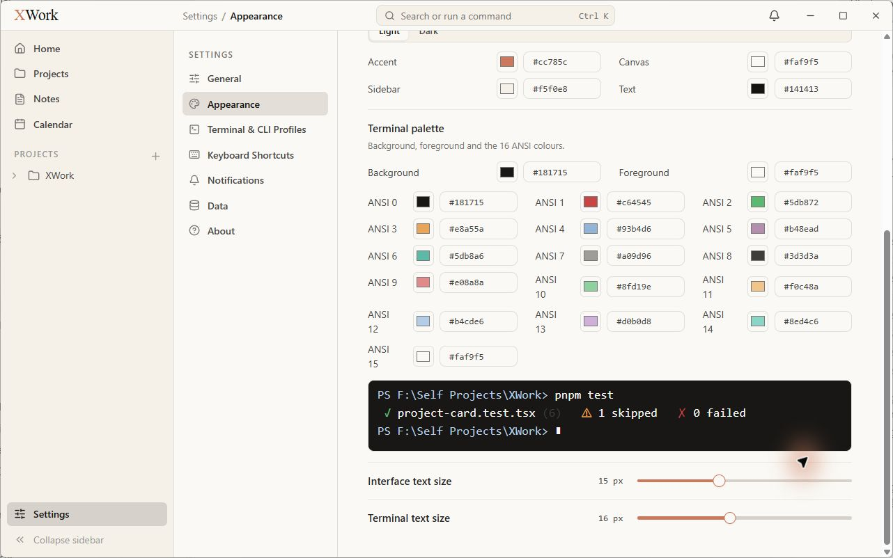
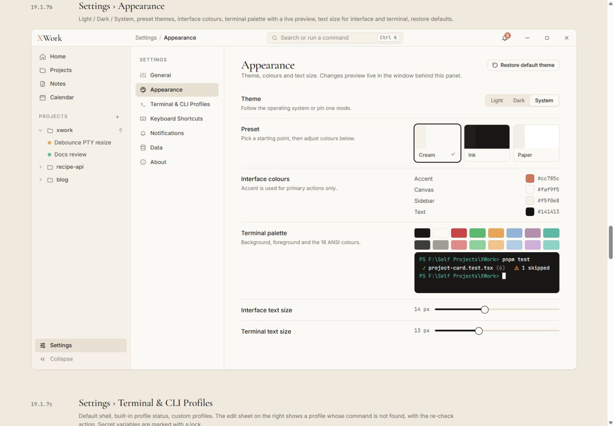

# Settings — Appearance — đối chiếu UI

Ngày kiểm tra: 13/09/2026. Trạng thái: chỉ ghi nhận, chưa sửa. Điều kiện chung và cách hiểu mức độ: [Tổng quan](00-Overview.md).

## Wireframe đối chiếu

- [19.1.7b — Appearance](../../01-Wireframe/02-AppShell.html#settings-appearance)

## Các bước đã quan sát

1. Mở Appearance, chụp phần đầu.
2. Cuộn tới bảng màu, preview và cỡ chữ; ghi nhận cấu hình hiện tại, không thay đổi.

## Điểm chưa khớp

### UI-APPEAR-01 · P2 — Bố cục nhãn/trường hai cột bị chuyển thành khối xếp dọc

- **Hiện tại:** Preset, Interface colours và Terminal palette lần lượt trải toàn chiều ngang bên dưới nhãn; preview và thanh cỡ chữ phải cuộn mới thấy.
- **Wireframe:** Mẫu đặt nhãn/mô tả bên trái, cụm điều khiển gọn bên phải; cả các thanh cỡ chữ nằm trong khung 800 px.
- **Ảnh hưởng:** Mất khả năng quan sát tương quan các chỉnh sửa cùng lúc; trang dài và nặng.
- **Bằng chứng:** [22-app-settings-appearance-top](assets/2026-09-13/22-app-settings-appearance-top.jpg) · [23-app-settings-appearance-bottom](assets/2026-09-13/23-app-settings-appearance-bottom.jpg) · [22-ref-settings-appearance](assets/2026-09-13/22-ref-settings-appearance.jpg).

### UI-APPEAR-02 · P2 — Bảng ANSI thành lưới nhập mã dài và gãy nhãn

- **Hiện tại:** ANSI 10–15 xuống hai dòng; mỗi màu có label, ô swatch và ô hex riêng; bộ màu trải nhiều hàng.
- **Wireframe:** Mẫu là hai dãy swatch nhỏ nằm trên preview terminal.
- **Ảnh hưởng:** Khó quét bảng màu; cách bố trí nhãn đang bị gãy ngay tại kích thước audit.
- **Bằng chứng:** [23-app-settings-appearance-bottom](assets/2026-09-13/23-app-settings-appearance-bottom.jpg) · [22-ref-settings-appearance](assets/2026-09-13/22-ref-settings-appearance.jpg).

### UI-APPEAR-03 · P2 — Trạng thái preset và slider dùng accent khác quy ước

- **Hiện tại:** Viền Cream đang chọn, dấu tick và track slider dùng coral.
- **Wireframe:** Mẫu dùng vòng chọn ink và slider ink; coral ưu tiên hành động chính.
- **Ảnh hưởng:** Thêm nhiều điểm nhấn màu không cần thiết và khác hệ thống lựa chọn trong thiết kế.
- **Bằng chứng:** [22-app-settings-appearance-top](assets/2026-09-13/22-app-settings-appearance-top.jpg) · [23-app-settings-appearance-bottom](assets/2026-09-13/23-app-settings-appearance-bottom.jpg) · [22-ref-settings-appearance](assets/2026-09-13/22-ref-settings-appearance.jpg).

## Giới hạn kiểm tra

Cấu hình quan sát: Light, Cream, interface 15 px, terminal 16 px; Accent #cc785c, Canvas #faf9f5, Sidebar #f5f0e8, Text #141413. Giá trị cỡ chữ khác mẫu là cấu hình có sẵn, không tự ghi là bug. Chưa kiểm tra dark mode, chỉnh màu hoặc restore.

## Ảnh đối chiếu

Ảnh app và wireframe được giữ nguyên; ảnh wireframe có phần chú thích ngoài khung ứng dụng.

### 22-app-settings-appearance-top

### 23-app-settings-appearance-bottom

### 22-ref-settings-appearance

