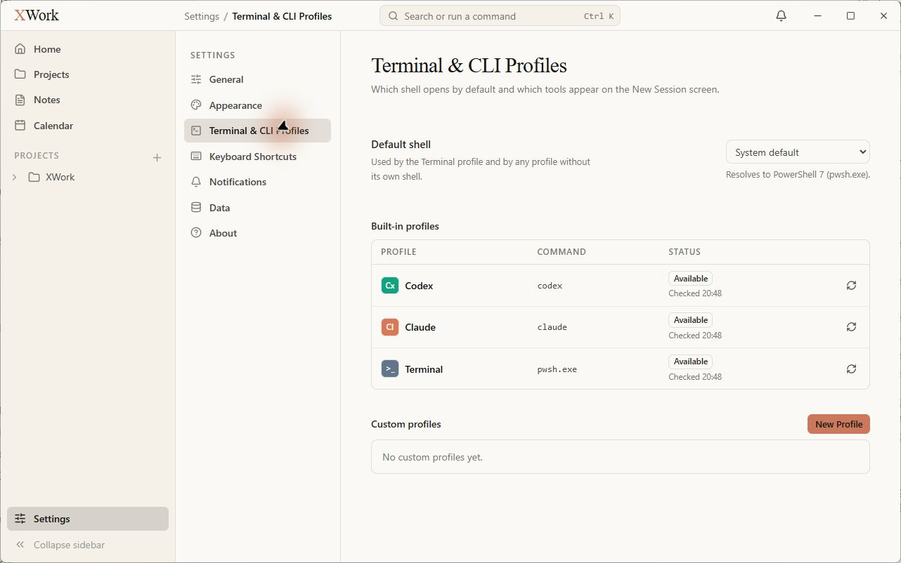
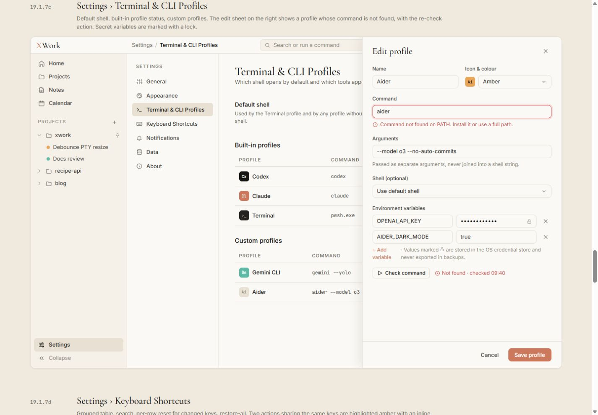
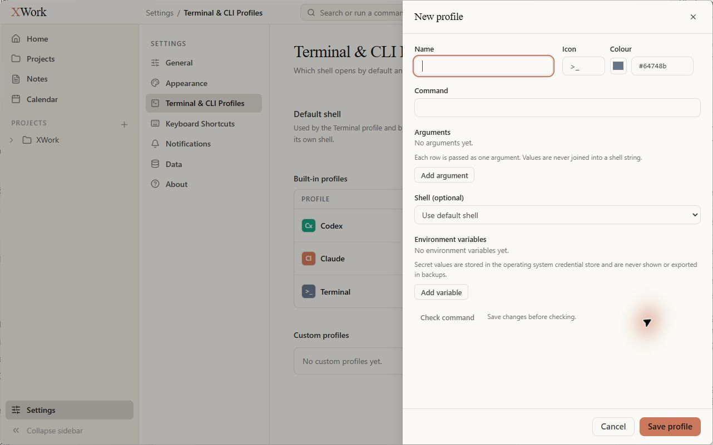

# Settings — Terminal & CLI Profiles — đối chiếu UI

Ngày kiểm tra: 13/09/2026. Trạng thái: chỉ ghi nhận, chưa sửa. Điều kiện chung và cách hiểu mức độ: [Tổng quan](00-Overview.md).

## Wireframe đối chiếu

- [19.1.7c — Profiles và sheet chỉnh profile](../../01-Wireframe/02-AppShell.html#settings-terminal)

## Các bước đã quan sát

1. Mở Terminal & CLI Profiles.
2. Mở New Profile để quan sát form rỗng rồi đóng bằng Escape; không lưu hoặc chạy Check command.

## Điểm chưa khớp

### UI-PROFILE-01 · P2 — Dấu công cụ và kiểu bảng chưa thống nhất với mẫu

- **Hiện tại:** Codex xanh ngọc, Terminal xanh xám; bảng built-in có khung bo góc bao ngoài tạo cảm giác card.
- **Wireframe:** Mẫu dùng mark Codex ink, Terminal dark-elevated; bảng nhẹ với đường chia hàng.
- **Ảnh hưởng:** Cùng lỗi màu mark tại bộ chọn session; bảng cài đặt trông nặng hơn thiết kế.
- **Bằng chứng:** [24-app-settings-terminal](assets/2026-09-13/24-app-settings-terminal.jpg) · [24-ref-settings-terminal](assets/2026-09-13/24-ref-settings-terminal.jpg).

### UI-PROFILE-02 · P2 — Sheet profile rộng và tổ chức trường khác mẫu

- **Hiện tại:** Sheet New profile chiếm khoảng 560 px; Name, Icon, Colour là ba trường với mã hex; Arguments là khu vực trống và Add argument.
- **Wireframe:** Mẫu sheet khoảng 480 px, Name và Icon & colour được nhóm, command/arguments có dòng nhập gọn.
- **Ảnh hưởng:** Biểu mẫu dàn trải và mang nhiều chi tiết kỹ thuật hơn thiết kế. Khác biệt New/Edit không được dùng để kết luận thiếu validation.
- **Bằng chứng:** [25-app-profile-form](assets/2026-09-13/25-app-profile-form.jpg) · [24-ref-settings-terminal](assets/2026-09-13/24-ref-settings-terminal.jpg).

### UI-PROFILE-03 · P3 — Hành động thêm biến/đối số nặng hơn hành động phụ trong mẫu

- **Hiện tại:** Add argument và Add variable đều là nút có viền; phần trống có nhiều dòng giải thích.
- **Wireframe:** Mẫu dùng liên kết + Add variable nhẹ và vùng nhập trực tiếp, mật độ gọn.
- **Ảnh hưởng:** Nhiều điểm viền và khoảng trắng làm form thiếu tập trung.
- **Bằng chứng:** [25-app-profile-form](assets/2026-09-13/25-app-profile-form.jpg) · [24-ref-settings-terminal](assets/2026-09-13/24-ref-settings-terminal.jpg).

## Giới hạn kiểm tra

Mẫu đang minh họa Edit profile có dữ liệu, còn app được chụp ở New profile rỗng. Không kết luận thiếu trạng thái command error, secret lock hay cấu trúc hàng variable sau khi thêm; không thay đổi thiết lập profile.

## Ảnh đối chiếu

Ảnh app và wireframe được giữ nguyên; ảnh wireframe có phần chú thích ngoài khung ứng dụng.

### 24-app-settings-terminal

### 24-ref-settings-terminal

### 25-app-profile-form

