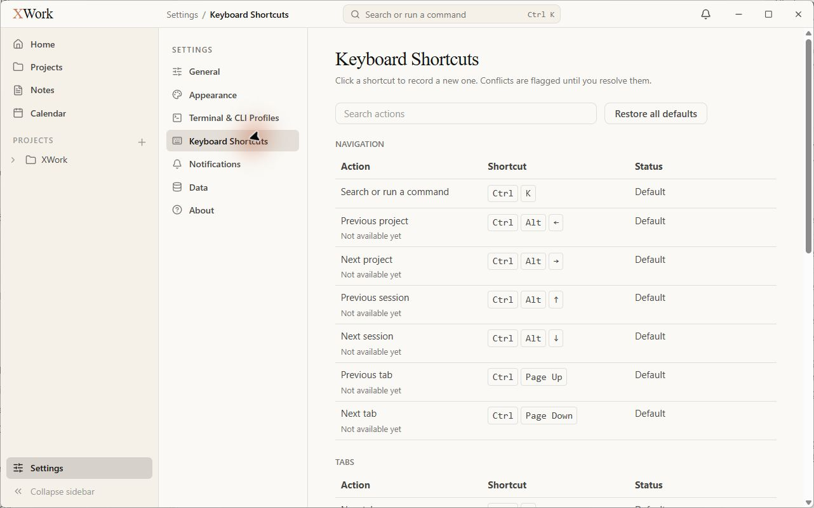
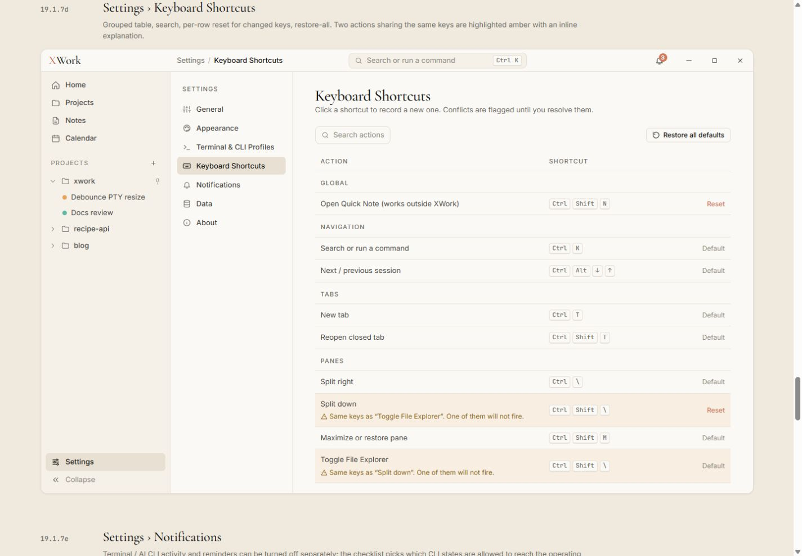

# Settings — Keyboard Shortcuts — đối chiếu UI

Ngày kiểm tra: 13/09/2026. Trạng thái: chỉ ghi nhận, chưa sửa. Điều kiện chung và cách hiểu mức độ: [Tổng quan](00-Overview.md).

## Wireframe đối chiếu

- [19.1.7d — Keyboard Shortcuts](../../01-Wireframe/02-AppShell.html#settings-shortcuts)

## Các bước đã quan sát

1. Mở Keyboard Shortcuts, quan sát phần đầu danh sách và các nhóm có trong cây accessibility.

## Điểm chưa khớp

### UI-KEY-01 · P2 — Mật độ bảng thấp và nhóm Global bị đẩy xuống cuối

- **Hiện tại:** Nhiều dòng Previous/Next tách riêng kèm Not available yet làm màn hình đầu gần như chỉ có Navigation; Global đứng sau Panes.
- **Wireframe:** Mẫu đặt Global trước, nhóm hàng gọn và chỉ dùng một tiêu đề cột chung với phân đoạn nhóm.
- **Ảnh hưởng:** Khó thấy shortcut Quick Note và các nhóm thao tác khác mà không cuộn nhiều.
- **Bằng chứng:** [26-app-settings-shortcuts](assets/2026-09-13/26-app-settings-shortcuts.jpg) · [26-ref-settings-shortcuts](assets/2026-09-13/26-ref-settings-shortcuts.jpg).

### UI-KEY-02 · P2 — Cách đặt search, reset và cột trạng thái khác mẫu

- **Hiện tại:** Search chiếm gần hết nửa trang; Restore all defaults nằm sát bên thay vì mép phải; mỗi nhóm lặp Action/Shortcut/Status, chữ Default khá nổi.
- **Wireframe:** Mẫu search gọn bên trái, restore sát phải, tên cột nhỏ và status phụ nhẹ.
- **Ảnh hưởng:** Bảng nhiều chrome lặp, phân cấp hành động/phím tắt yếu hơn.
- **Bằng chứng:** [26-app-settings-shortcuts](assets/2026-09-13/26-app-settings-shortcuts.jpg) · [26-ref-settings-shortcuts](assets/2026-09-13/26-ref-settings-shortcuts.jpg).

## Giới hạn kiểm tra

Chưa mở recorder, tạo conflict hoặc reset. Số lượng shortcut có thể khác mẫu do phát triển chức năng; vấn đề ở đây là cách bố trí và trạng thái chưa khả dụng đang chiếm diện tích.

## Ảnh đối chiếu

Ảnh app và wireframe được giữ nguyên; ảnh wireframe có phần chú thích ngoài khung ứng dụng.

### 26-app-settings-shortcuts

### 26-ref-settings-shortcuts

