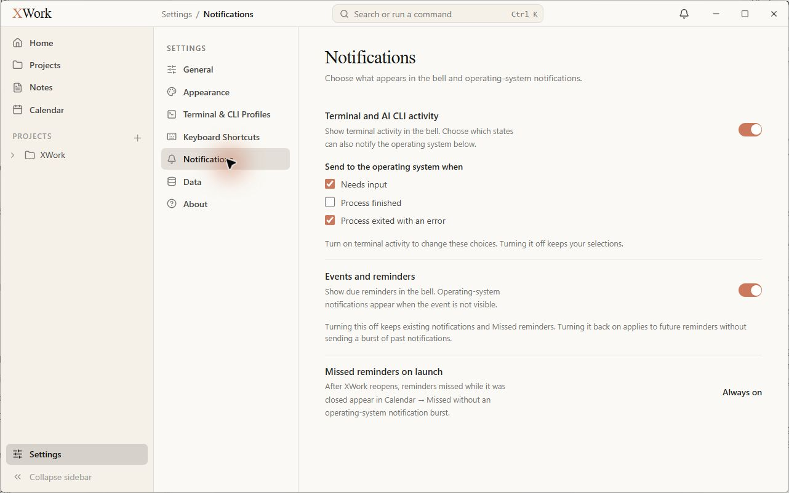
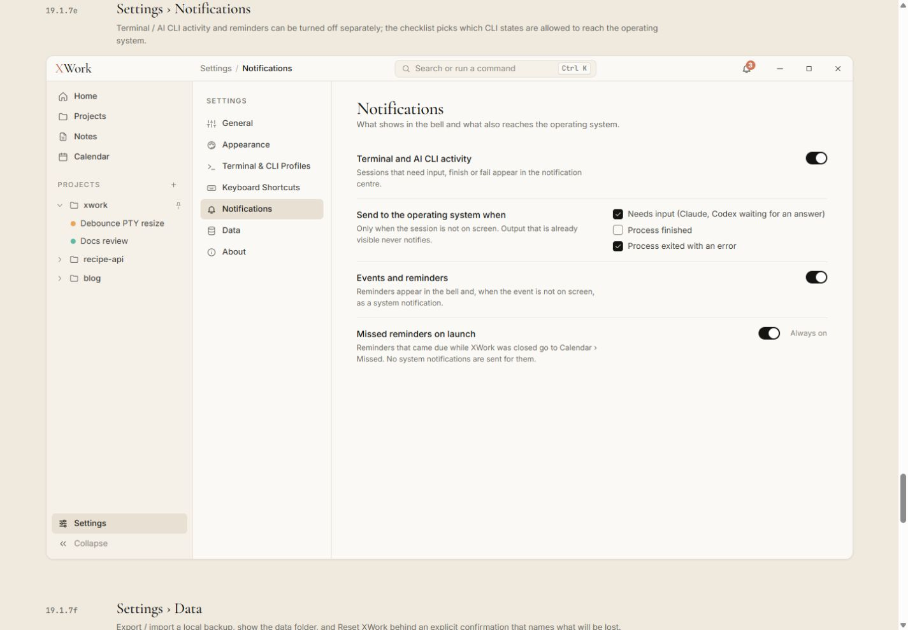

# Settings — Notifications — đối chiếu UI

Ngày kiểm tra: 13/09/2026. Trạng thái: chỉ ghi nhận, chưa sửa. Điều kiện chung và cách hiểu mức độ: [Tổng quan](00-Overview.md).

## Wireframe đối chiếu

- [19.1.7e — Notifications](../../01-Wireframe/02-AppShell.html#settings-notifications)

## Các bước đã quan sát

1. Mở Settings → Notifications, chỉ quan sát giá trị hiện tại.

## Điểm chưa khớp

### UI-NOTIFY-01 · P2 — Checklist thông báo bị đặt dưới nhãn bên trái

- **Hiện tại:** Needs input/Process finished/Process exited with an error nằm thành một khối dưới tiêu đề Send to the operating system when; bên phải bỏ trống.
- **Wireframe:** Mẫu nhãn và giải thích ở trái, checklist ở cột điều khiển bên phải.
- **Ảnh hưởng:** Lệch trục các control so với switch và tăng chiều cao trang.
- **Bằng chứng:** [27-app-settings-notifications](assets/2026-09-13/27-app-settings-notifications.jpg) · [27-ref-settings-notifications](assets/2026-09-13/27-ref-settings-notifications.jpg).

### UI-NOTIFY-02 · P2 — Cách hiển thị bật/luôn bật thiếu nhất quán

- **Hiện tại:** Switch và checkbox dùng coral; Missed reminders on launch chỉ có chữ Always on, không có hình switch như mẫu. Dòng Turn on terminal activity… xuất hiện dù activity đang bật.
- **Wireframe:** Mẫu switch/checkbox bật màu ink; trạng thái cố định vẫn thể hiện switch kèm Always on; mô tả không mâu thuẫn trực quan với control đang bật.
- **Ảnh hưởng:** Khó hiểu ngay trạng thái và quyền chỉnh sửa; màu lựa chọn khác hệ thống.
- **Bằng chứng:** [27-app-settings-notifications](assets/2026-09-13/27-app-settings-notifications.jpg) · [27-ref-settings-notifications](assets/2026-09-13/27-ref-settings-notifications.jpg).

## Giới hạn kiểm tra

Không thay đổi checkbox/switch, không thử thông báo OS. Không đánh giá logic notification routing hoặc permission hệ điều hành.

## Ảnh đối chiếu

Ảnh app và wireframe được giữ nguyên; ảnh wireframe có phần chú thích ngoài khung ứng dụng.

### 27-app-settings-notifications

### 27-ref-settings-notifications

