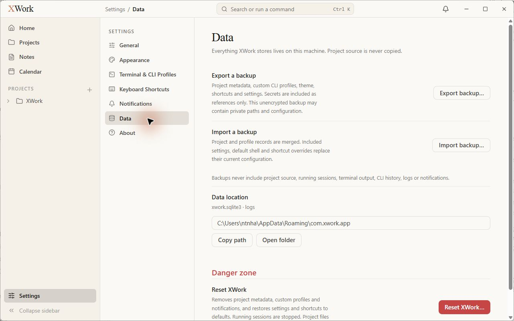
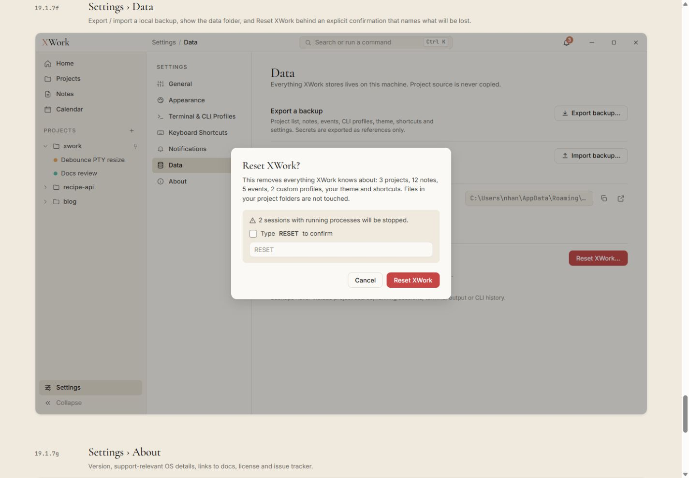
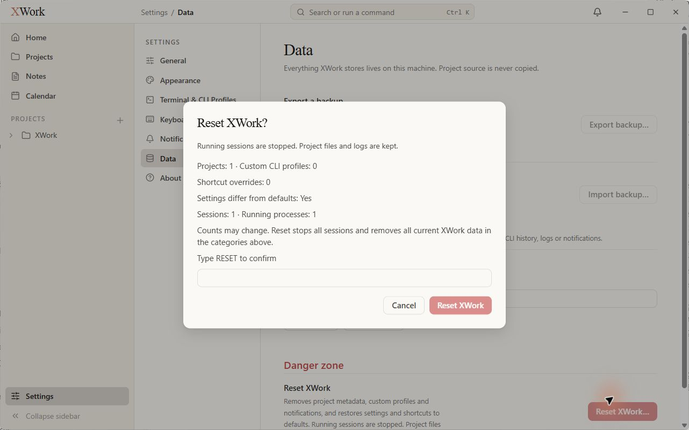

# Settings — Data và hộp thoại Reset — đối chiếu UI

Ngày kiểm tra: 13/09/2026. Trạng thái: chỉ ghi nhận, chưa sửa. Điều kiện chung và cách hiểu mức độ: [Tổng quan](00-Overview.md).

## Wireframe đối chiếu

- [19.1.7f — Data/Reset](../../01-Wireframe/02-AppShell.html#settings-data)

## Các bước đã quan sát

1. Mở Data, chụp trang.
2. Bấm Reset XWork… để xem hộp thoại xác nhận, không nhập RESET và bấm Cancel.

## Điểm chưa khớp

### UI-DATA-01 · P2 — Data location chuyển thành một khối nhiều hàng

- **Hiện tại:** Đường dẫn chiếm toàn chiều ngang phía dưới nhãn, Copy path/Open folder là hai nút chữ ở dòng kế tiếp.
- **Wireframe:** Mẫu đặt ô path ngắn bên phải với hai icon cùng hàng.
- **Ảnh hưởng:** Phần quản lý dữ liệu bị kéo dài, Danger zone sát đáy/cần cuộn trong khung hiện tại.
- **Bằng chứng:** [28-app-settings-data](assets/2026-09-13/28-app-settings-data.jpg) · [28-ref-settings-data](assets/2026-09-13/28-ref-settings-data.jpg).

### UI-DATA-02 · P2 — Hộp thoại Reset rộng và mất facts box

- **Hiện tại:** Dialog thực tế rộng khoảng 600 px; số lượng project/profile/session và điều kiện xác nhận là nhiều dòng text trực tiếp trên nền trắng kem.
- **Wireframe:** Mẫu dialog khoảng 460 px, các thông tin cảnh báo và xác nhận được gom trong facts box màu kem đậm, có icon cảnh báo.
- **Ảnh hưởng:** Thông tin rủi ro khó quét, hộp thoại mất phần phân cấp quan trọng.
- **Bằng chứng:** [29-app-settings-reset-dialog](assets/2026-09-13/29-app-settings-reset-dialog.jpg) · [28-ref-settings-data](assets/2026-09-13/28-ref-settings-data.jpg).

### UI-DATA-03 · P3 — Hành động backup thiếu icon và trang có nhiều đoạn copy hơn mẫu

- **Hiện tại:** Export/Import là nút chỉ có chữ; các đoạn giải thích dài làm hai hàng backup cao và đẩy các phần sau xuống.
- **Wireframe:** Mẫu có icon xuất/nhập và các hàng ngắn, cân đối với control bên phải.
- **Ảnh hưởng:** Màn hình nặng chữ, kém gọn dù số thao tác ít.
- **Bằng chứng:** [28-app-settings-data](assets/2026-09-13/28-app-settings-data.jpg) · [28-ref-settings-data](assets/2026-09-13/28-ref-settings-data.jpg).

## Giới hạn kiểm tra

Chỉ mở và hủy dialog; không export, import, reset, copy hoặc mở thư mục dữ liệu. Không kiểm chứng nội dung backup hay kết luận mất dữ liệu từ copy khác mẫu.

## Ảnh đối chiếu

Ảnh app và wireframe được giữ nguyên; ảnh wireframe có phần chú thích ngoài khung ứng dụng.

### 28-app-settings-data

### 28-ref-settings-data

### 29-app-settings-reset-dialog

