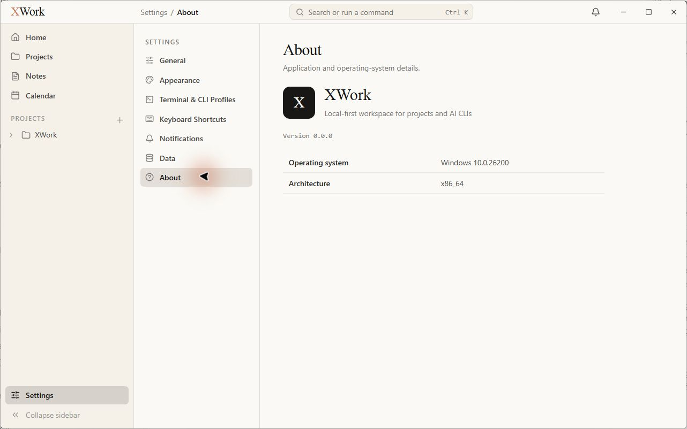
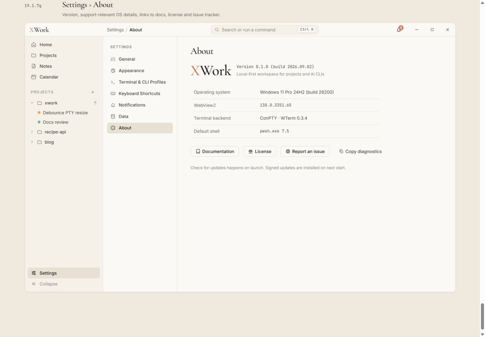

# Settings — About — đối chiếu UI

Ngày kiểm tra: 13/09/2026. Trạng thái: chỉ ghi nhận, chưa sửa. Điều kiện chung và cách hiểu mức độ: [Tổng quan](00-Overview.md).

## Wireframe đối chiếu

- [19.1.7g — About](../../01-Wireframe/02-AppShell.html#settings-about)

## Các bước đã quan sát

1. Mở About và quan sát toàn bộ nội dung ở khung hiện tại.

## Điểm chưa khớp

### UI-ABOUT-01 · P2 — Khối thương hiệu khác bố cục và phong cách mẫu

- **Hiện tại:** Có icon vuông đen chữ X lớn, XWork bên cạnh và Version ở một dòng riêng phía dưới.
- **Wireframe:** Mẫu dùng wordmark X coral + Work serif, version/build và mô tả ở bên cạnh, không có ô icon đen lớn.
- **Ảnh hưởng:** Nhận diện của trang giới thiệu không khớp wordmark/khung ứng dụng.
- **Bằng chứng:** [30-app-settings-about](assets/2026-09-13/30-app-settings-about.jpg) · [30-ref-settings-about](assets/2026-09-13/30-ref-settings-about.jpg).

### UI-ABOUT-02 · P2 — Thiếu phần thông tin và dãy hành động hỗ trợ trong mẫu

- **Hiện tại:** App chỉ có Operating system và Architecture; không thấy WebView2, Terminal backend, Default shell, Documentation, License, Report an issue, Copy diagnostics hay dòng cập nhật.
- **Wireframe:** Các thông tin môi trường và hành động hỗ trợ nằm thành một khối đầy đủ dưới thương hiệu.
- **Ảnh hưởng:** About trống và thiếu các điểm truy cập được thiết kế. Đây là chênh lệch nội dung UI, chưa xác định phần nào được chủ ý hoãn theo đặc tả mới.
- **Bằng chứng:** [30-app-settings-about](assets/2026-09-13/30-app-settings-about.jpg) · [30-ref-settings-about](assets/2026-09-13/30-ref-settings-about.jpg).

## Giới hạn kiểm tra

Không coi version 0.0.0 so với 0.1.0 trong dữ liệu minh họa là lỗi. Không khẳng định tên Windows hiển thị sai khi chưa xác minh cách chuẩn hóa tên OS.

## Ảnh đối chiếu

Ảnh app và wireframe được giữ nguyên; ảnh wireframe có phần chú thích ngoài khung ứng dụng.

### 30-app-settings-about

### 30-ref-settings-about

